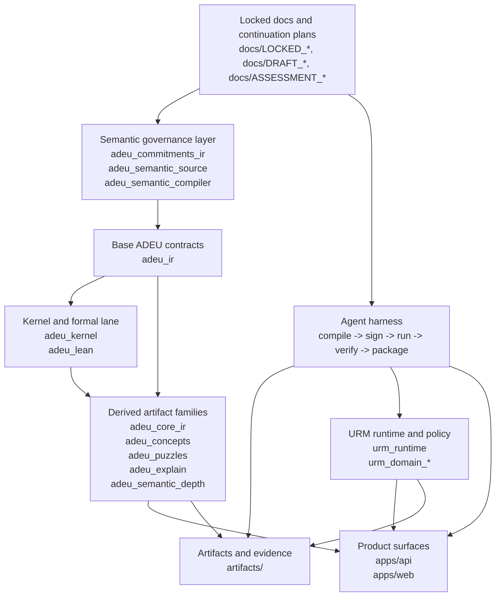
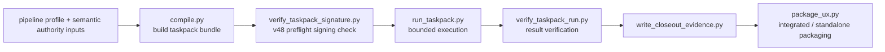

# ODEU Repo Atlas

This repository presents as `odeu`, but the system inside the tree is mostly expressed as `ADEU Studio`: a governed artifact pipeline where docs lock intent, typed IR packages define contract surfaces, validators enforce determinism, and runtime/harness layers turn that into controlled execution.

## The Short Version

- This is not "just an app".
- It is a monorepo with `17` Python packages, `2` app surfaces, and `146` top-level docs in `docs/`.
- The deepest pattern in the repo is: canonical JSON + stable hashes + fail-closed validation + explicit evidence.

## The Repo In One Picture



## The Main Mental Models

### 1. Semantic authority lives in docs

The repo is increasingly treating docs as source code. `LOCKED_CONTINUATION_*`, stop-gate decisions, transfer reports, and architecture specs are not just commentary; they are part of the control plane. The semantic compiler track exists to make that relationship more machine-checkable over time.

### 2. Typed artifacts are the real center of gravity

The core packages define and validate explicit artifact families:

| Cluster | Main packages | What they do |
| --- | --- | --- |
| Base contract layer | `adeu_ir` | ADEU IR, IDs, schemas, reason codes |
| Validation layer | `adeu_kernel`, `adeu_lean` | deterministic checking, proof lane, validator evidence |
| Derived ADEU families | `adeu_core_ir`, `adeu_concepts`, `adeu_puzzles`, `adeu_explain`, `adeu_semantic_depth` | projections, analysis, diffs, question loops, reports |
| Semantic governance | `adeu_commitments_ir`, `adeu_semantic_source`, `adeu_semantic_compiler` | docs/spec compilation into commitments and build artifacts |
| Runtime governance | `urm_runtime`, `urm_domain_adeu`, `urm_domain_digest`, `urm_domain_paper` | policy, orchestration, evidence, worker/copilot runtime |
| Operational shipping lane | `adeu_agent_harness` | deterministic taskpack compile, execution, verification, packaging |

### 3. The repo has two product surfaces, but many internal lanes

- `apps/api` is the integration hub.
- `apps/web` is the human-facing UI.

But the real internal shape is broader than those apps: semantic compilation, validator/proof flows, URM runtime governance, and the taskpack harness all behave like first-class subsystems.

## The Main Loop

```text
locked continuation docs
    -> semantic/compiler authority inputs
    -> typed artifacts and hashes
    -> taskpack compilation
    -> preflight trust checks
    -> constrained execution
    -> verification and evidence writing
    -> packaging
    -> API/UI/runtime consumption
```

In more concrete repo terms:

1. Docs define what the current arc is allowed to change.
2. Artifact packages define the payload shapes and invariants.
3. The kernel and related validators decide whether a payload is valid.
4. URM governs tool/worker execution under policy and evidence capture.
5. The agent harness turns a locked slice into a deterministic taskpack lifecycle.
6. The API and web app expose those capabilities.

## The Harness Pipeline

The `adeu_agent_harness` package is its own mini-system. Its current shape is roughly:



That pipeline matters because it turns continuation policy into an executable, replayable unit with frozen evidence boundaries.

## Current Frontier: v48 / V34-A

The latest finished slice is narrow on purpose.

- Planning family: `docs/DRAFT_NEXT_ARC_OPTIONS_v8.md`
- Selected path: `V34-A`
- Arc lock: `docs/LOCKED_CONTINUATION_vNEXT_PLUS48.md`
- Closeout posture: `docs/DRAFT_STOP_GATE_DECISION_vNEXT_PLUS48.md`

What v48 actually added:

- deterministic signing preflight for taskpacks;
- single-signature envelope semantics only;
- trust-anchor registry with exact key-id and algorithm binding;
- explicit reference-time checking for revocation/expiry;
- fail-closed `AHK48xx` rejection diagnostics;
- deterministic `signature_verification_result@1` for downstream lanes.

What v48 did **not** add:

- no runtime semantics expansion;
- no multi-signer governance;
- no matrix-lane parity release;
- no zero-trust recompute release;
- no `L2` boundary release.

The important interpretation is that `v48` strengthens authenticity around the harness boundary instead of widening the product surface.

## The Strongest Things About The Repo

- The repo has a real architectural spine: determinism, canonical hashing, fail-closed behavior, explicit evidence.
- Slice discipline is unusually strong. Features are landed as narrow arcs with lock docs, assessments, tests, and closeout artifacts.
- CI is serious and multi-lane: Python, Lean formal checks, and web all have dedicated jobs.
- The packaging/runtime/harness story is much more rigorous than a typical app repo.

## The Pressure Points

- `apps/api/src/adeu_api/main.py` is the main integration gravity well at `8377` lines. It works as the system hub, but it is also a long-term maintenance and review hotspot.
- The docs corpus is powerful but dense. It gives strong continuity, yet raises onboarding cost and makes architectural intent expensive to reconstruct without a map.
- The harness is well sliced, but versioned helpers (`_v46_*`, `_v47_*`, `_v48_*`) signal a likely future need for consolidation once the trust/distribution family stabilizes.
- Local verification depends on the monorepo bootstrap contract. A plain `python -m pytest` from repo root fails without editable installs or explicit `PYTHONPATH`, so the repo is optimized for disciplined setup rather than casual execution.

## One Important Near-Term Caveat

The new v48 downstream validator helper exists, but today it appears to be referenced only in the v48 test suite, not yet wired across every later harness lane. So the trust contract is implemented, but full system value still depends on future downstream adoption.

## How To Read This Repo Without Getting Lost

1. Read `docs/DRAFT_NEXT_ARC_OPTIONS_v8.md` and `docs/LOCKED_CONTINUATION_vNEXT_PLUS48.md` first.
2. Read `packages/adeu_agent_harness/` next if you want the current operational frontier.
3. Read `packages/adeu_ir/`, `packages/adeu_kernel/`, and `packages/adeu_core_ir/` to understand the artifact/validator center.
4. Read `packages/urm_runtime/` to understand policy, workers, evidence, and runtime governance.
5. Read `apps/api/src/adeu_api/main.py` and `apps/api/src/adeu_api/urm_routes.py` only after the package-level picture is clear.
6. Read `apps/web/` last; it is a surface over the deeper machinery, not the source of system truth.

## Bottom Line

The best way to understand this repository is:

- not as a web app with some libraries,
- not as a research repo with some endpoints,
- but as a governed machine for producing, validating, executing, and packaging high-trust artifacts.

The current `v48` slice fits that identity cleanly: it makes the taskpack lane harder to spoof without changing the repo's broader semantic authority model.
