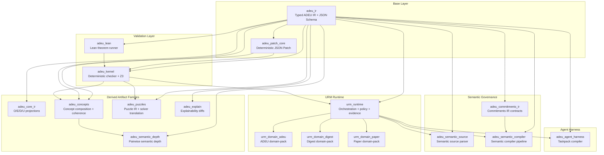
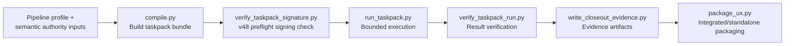
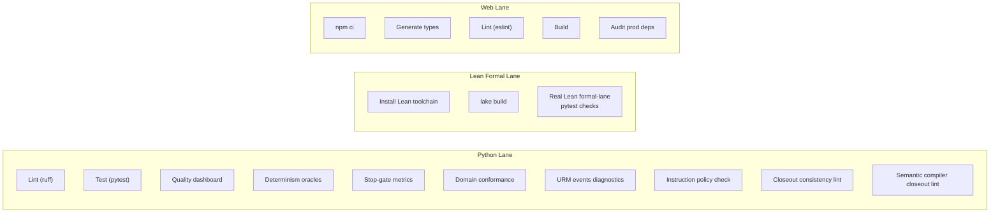

# ADEU Studio — Architecture & Capabilities v0

**Status:** working draft snapshot · 2026-03-19
**Scope:** complete system architecture, capability inventory, and governance model
**Methodology:** structured through the ADEU O/E/D/U axes (Ontology, Epistemics, Deontics, Utility)

---

## 1. System Identity

ADEU Studio is **not** a conventional web application with some library support.

It is a **governed machine for producing, validating, executing, and packaging high-trust artifacts** inside a composite human–machine intelligence system. Every subsystem in the repository exists to serve that single function: take unstructured legal, conceptual, or analytical inputs, compile them into typed intermediate representations, validate them deterministically, and produce artifacts with explicit evidence trails.

The deepest invariant in the codebase:

> **Canonical JSON + stable hashes + fail-closed validation + explicit evidence.**

---

## 2. ADEU Methodology Frame

ADEU is the governing framework of the entire system. The acronym decomposes into four evaluation axes. Every architectural decision, integration decision, and artifact in the system is accountable to all four.

| Axis | Question It Answers | Role In The Architecture |
|------|---------------------|--------------------------|
| **Ontology** | What exists? What are the entities, layers, boundaries? | Typed IR schemas, package boundaries, explicit artifact families |
| **Epistemics** | What can be known? Under what evidence? | Deterministic validators, solver evidence, proof certificates, hashed provenance |
| **Deontics** | What is permitted, prohibited, obligated? | Policy files, capability lattice, role-gated tools, fail-closed rejection |
| **Utility** | What serves the declared goals? At what cost? | Arc-scoped slices, quality dashboards, stop-gate metrics, governed self-improvement |

This is not decorative terminology. The four axes are embedded in:
- the IR type system (`adeu_core_ir` carries O/E/D/U projections),
- the validation pipeline (solver evidence = epistemic; capability lattice = deontic),
- the development process (locked continuation docs = deontic + utility constraints on what may change),
- the self-improvement policy (any integration must be mappable across all four axes).

---

## 3. Monorepo Structure

```
odeu/
├── packages/          17 Python packages (the system's typed core)
├── apps/
│   ├── api/           FastAPI integration hub
│   └── web/           Next.js human-facing UI
├── docs/              230+ governance docs (LOCKED, DRAFT, ASSESSMENT, TRANSFER)
├── spec/              54 JSON Schemas (canonical contract surfaces)
├── policy/            6 runtime policy files (URM capability lattice, profiles, etc.)
├── artifacts/         Committed build/closeout artifacts (quality dashboards, stop-gate, harness)
├── examples/          Fixtures, eval sets, puzzle/concept examples
├── .github/workflows/ CI (3-lane: Python, Lean formal, Web)
├── Makefile           Bootstrap, test, lint, check, arc-bundle gates
└── pyproject.toml     Root ruff/pytest config (Python 3.14+)
```

---

## 4. Conceptual System Layering

This diagram is a conceptual layering map for the repo, not a dependency-exact graph derived from package manifests.



---

## 5. Package Catalog

### 5.1 Base Contract Layer

| Package | Description |
|---------|-------------|
| `adeu_ir` | **Single source of truth.** Pydantic ADEU IR models, IDs, schemas, reason codes. JSON Schema export. No solver, no side-effects. |
| `adeu_patch_core` | Shared deterministic JSON Patch primitives consumed by kernel and concept packages. |

### 5.2 Validation Layer

| Package | Description |
|---------|-------------|
| `adeu_kernel` | Deterministic checking engine. Golden fixture harness. Z3 solver backend (`z3-solver==4.13.3.0`) for conflict witness encoding. Produces `ValidatorResult` evidence. |
| `adeu_lean` | Lean 4 theorem request/result models and CLI runner helpers. Bridges Python IR to the Lean proof backend for formal verification of theorem obligations (`pred_closed_world`, `exception_gating`, `conflict_soundness`). |

### 5.3 Derived Artifact Families

| Package | Description |
|---------|-------------|
| `adeu_core_ir` | Typed O/E/D/U core projection IR + deterministic contract validators. Projects artifacts into ontological, epistemic, deontic, and utility facets. |
| `adeu_concepts` | Concept composition IR + coherence checker. SAT/UNSAT analysis, forced-edge analysis, MIC extraction, question generation. |
| `adeu_puzzles` | Knights & Knaves puzzle IR + deterministic solver translation. Per-person role assignments via Z3. |
| `adeu_explain` | Deterministic explainability diffs across ADEU, concept, and puzzle validator runs. Produces flip narratives, cause chains, and repair hints. |
| `adeu_semantic_depth` | Pairwise semantic-depth reporting for concept artifacts. |

### 5.4 Semantic Governance

| Package | Description |
|---------|-------------|
| `adeu_commitments_ir` | Typed commitments IR contract models + schema export. Represents machine-checkable commitments extracted from governance docs. |
| `adeu_semantic_source` | Deterministic semantic-source parser/normalizer. Extracts structured data from YAML-fronted markdown docs for the compiler. |
| `adeu_semantic_compiler` | Deterministic semantic compiler pipeline. Turns locked doc authority + commitments into build artifacts. Closes the loop: docs → machine-checkable contracts. |

### 5.5 URM Runtime & Policy

| Package | Description |
|---------|-------------|
| `urm_runtime` | Portable URM orchestration runtime. Policy enforcement, evidence capture, event stream tools (`events` CLI), stop-gate metrics (`stop-gate` CLI), policy tools (`policy` CLI). Ships embedded policy JSON. |
| `urm_domain_adeu` | ADEU domain-pack adapters for URM runtime (ADEU-specific tool implementations). |
| `urm_domain_digest` | Digest domain-pack adapters (document digest workflows). |
| `urm_domain_paper` | Paper abstract domain-pack adapters (paper ingestion workflows). |

### 5.6 Operational Shipping Lane

| Package | Description |
|---------|-------------|
| `adeu_agent_harness` | Deterministic taskpack compiler. Full lifecycle: compile → preflight signing check → bounded execution → result verification → closeout evidence → UX packaging. |

---

## 6. Governance Architecture

### 6.1 Docs as Semantic Authority

The repository treats governance documents as **source code for intent**:

- **`LOCKED_CONTINUATION_vNEXT_PLUS{N}.md`** — arc lock documents. Define what the current development arc is permitted to change. Once locked, they are immutable.
- **`DRAFT_STOP_GATE_DECISION_vNEXT_PLUS{N}.md`** — stop/go decisions with risk assessments.
- **`ASSESSMENT_vNEXT_PLUS{N}_EDGES.md`** — edge-case analysis for each arc.
- **`DRAFT_NEXT_ARC_OPTIONS_v{N}.md`** — prospective continuation paths with scope, risks, and criteria.
- **Transfer reports** — evidence of what was carried forward between arcs.

There are currently **71 locked continuation docs** in-tree (v1 through v71). Stop-gate, assessment, and closeout coverage exists across many arcs, but should be checked per arc rather than assumed to be uniform.

### 6.2 Arc-Slice Discipline

Features are **never** landed as unbounded changes. Every feature ships as a narrow arc with:

1. A locked continuation doc (scope commitment)
2. An assessment of edges and risks
3. A stop-gate decision (go / no-go with evidence)
4. Committed closeout artifacts (quality dashboard snapshots, stop-gate metrics)
5. Tests that cover the specific slice

### 6.3 The Semantic Compiler Track

The semantic compiler (`adeu_semantic_source` → `adeu_commitments_ir` → `adeu_semantic_compiler`) exists to progressively make the doc → contract relationship machine-checkable. This means the locked docs are not just prose — they are trending toward being compilable inputs to a verification pipeline.

---

## 7. Trust & Validation Pipeline

### 7.1 Epistemic Architecture (What Can Be Known, Under What Evidence)

The system maintains a layered trust model:

| Trust Lane | Backend | Strength |
|-----------|---------|----------|
| `kernel_only` | Deterministic Python checker | Baseline: syntactic + structural invariants |
| `solver_backed` | Z3 SAT/SMT solver | Conflict witness, forced-edge analysis, coherence checks |
| `proof_checked` | Lean 4 theorem prover | Formal certificates for theorem obligations |

**Key epistemic invariants:**
- **Fail-closed**: `UNKNOWN` and `TIMEOUT` map to `REFUSE` in `STRICT` mode. There is no "optimistic" path.
- **Deterministic assertion naming**: Z3 atoms are named `a:<object_id>:<sha256(json_path)[:12]>` for stable, reproducible unsat cores.
- **Solver output is evidence, not proof**: SMT results (models, unsat cores, stats) are explicitly classified as solver evidence. Proof certificates are reserved for the Lean lane.
- **Canonical hashing**: all artifacts carry stable content hashes for integrity verification.

### 7.2 Proof Pipeline (v3.1+)

Accepted artifacts produce one `ProofArtifact` per theorem obligation:
- `pred_closed_world`
- `exception_gating`
- `conflict_soundness`

Each proof artifact includes deterministic metadata: `semantics_version`, `inputs_hash`, `theorem_src_hash`, and `lean_version` when using the real Lean backend.

### 7.3 Taskpack Signing (v48)

The agent harness includes a deterministic signing preflight:
- Single-signature envelope semantics
- Trust-anchor registry with exact key-id and algorithm binding
- Reference-time checking for revocation/expiry
- Fail-closed `AHK48xx` rejection diagnostics

---

## 8. Agent Harness Pipeline

The `adeu_agent_harness` is the operational shipping lane that turns continuation policy into executable, replayable units with frozen evidence boundaries.



**Why this matters:** It transforms locked policy slices into deterministic, auditable execution units. A taskpack can be replayed, its evidence can be inspected, and its boundaries are frozen at compile time.

---

## 9. URM Runtime & Policy

### 9.1 Capability Lattice

The URM capability lattice (`policy/urm.capability.lattice.v1.json`) defines a typed action-to-capability mapping:

| Capability | Example Actions | Write Required | Approval Required |
|-----------|----------------|----------------|-------------------|
| `read_state` | `adeu.get_app_state`, `adeu.list_templates`, `adeu.read_evidence` | No | No |
| `run_analysis_check` | `adeu.run_workflow`, `paper.ingest_text`, `digest.check_constraints` | No | No |
| `spawn_worker` | `urm.spawn_worker` | No | No |
| `mutate_apply_patch` | `adeu.apply_patch` | **Yes** | **Yes** |
| `approve_write` | `urm.set_mode.enable_writes` | No | **Yes** |
| `manage_session_lifecycle` | `urm.turn.steer`, `urm.agent.spawn`, `urm.agent.cancel` | No | No |

### 9.2 Copilot / Worker Runtime

- **Copilot sessions**: Long-lived Codex-backed sessions with server-authoritative `writes_allowed` toggle, SSE event streaming with replay support.
- **Worker runs**: Short-lived `codex exec --json` runs with idempotency keys, executed in `read-only` sandbox mode.
- **Evidence capture**: All URM events are written to NDJSON event streams with deterministic schemas, validated by the `events` CLI tool.

### 9.3 Policy Files

| File | Purpose |
|------|---------|
| `urm.capability.lattice.v1.json` | Action → capability mapping with write/approval gates |
| `urm.allow.v1.json` | Runtime allow-list |
| `profiles.v1.json` | Pipeline profile definitions |
| `odeu.instructions.v1.json` | Instruction policy configuration |
| `incident_redaction_allowlist.v1.json` | Incident redaction controls |
| `connector_exposure_mapping.v1.json` | Connector exposure surface mapping |

---

## 10. Product Surfaces

### 10.1 API (`apps/api`)

FastAPI service serving as the integration hub. Selected endpoint families:

| Family | Endpoints | Purpose |
|--------|-----------|---------|
| **ADEU Core** | `POST /propose`, `POST /check`, `POST /artifacts` | ADEU IR proposal, validation, artifact storage |
| **Concepts** | `/concepts/propose`, `/check`, `/analyze`, `/apply_patch`, `/questions`, `/tournament`, `/align`, `/diff`, `/artifacts` | Concept composition, coherence analysis, patching, tournament ranking, cross-artifact alignment |
| **Puzzles** | `POST /puzzles/solve`, `POST /puzzles/propose` | Knights & Knaves puzzle solving |
| **Explain** | `POST /explain_flip` | Cross-domain flip narratives with cause chains |
| **URM Copilot** | `/urm/copilot/start`, `/send`, `/stop`, `/mode`, `/events` | Copilot session lifecycle + SSE |
| **URM Worker** | `POST /urm/worker/run` | Short-lived Codex worker runs |
| **URM Tools** | `POST /urm/tools/call` | Role-gated URM tool dispatch |
| **Proofs** | `GET /artifacts/{id}/proofs`, `/validator-runs` | Proof and evidence retrieval |

**Proposer backends:** `fixture` (mock, deterministic), `openai` (Responses/Chat API), `codex` (CLI exec).

### 10.2 Web (`apps/web`)

Next.js UI with selected routes:

| Route | Purpose |
|-------|---------|
| `/` | ADEU Studio (core clause → IR workflow) |
| `/concepts` | Concepts Studio (propose, check, analyze, compare, question loop, tournament) |
| `/puzzles` | Puzzle Studio (Knights & Knaves propose/check/solve/compare) |
| `/papers` | Paper Abstract Studio (documents-first concepts + cross-doc alignment) |
| `/artifacts` | Artifact browser |
| `/copilot` | Copilot runtime console (session controls, SSE timeline, tool actions, evidence viewer) |

---

## 11. CI & Quality Infrastructure

### 11.1 Three-Lane CI



**Smart scope detection:** CI detects whether a push is an arc-start bundle, arc-closeout bundle, or a full change. Arc bundles run only the relevant subset of checks instead of the full suite.

### 11.2 Committed Artifacts

| Artifact | Purpose |
|----------|---------|
| `quality_dashboard.json` | Per-arc quality metrics snapshot |
| `quality_dashboard_v{N}_closeout.json` | Frozen per-arc closeout quality snapshots (v18–v70) |
| `determinism_oracles.json` | Bridge/questions/patch oracle check results |
| `stop_gate/` | Stop-gate metrics and reports |
| `domain_conformance.json` | Domain conformance audit |
| `urm_events/` | URM event stream diagnostics (validate, replay, summary) |
| `semantic_compiler/` | Semantic compiler build artifacts |
| `agent_harness/` | Per-arc harness execution artifacts |

### 11.3 Make Targets

| Target | Purpose |
|--------|---------|
| `make bootstrap` | Create `.venv`, install all 17 packages + API in editable mode |
| `make test` | Run full pytest suite |
| `make lint` | Run ruff linter |
| `make format` | Run ruff formatter |
| `make check` | **Default local diff-aware gate:** lint + selector-driven pytest subset with conservative full-suite fallback + closeout lint + semantic closeout lint + instruction policy check |
| `make check-full` | **Explicit full local gate:** lint + full pytest + closeout lint + semantic closeout lint + instruction policy check |
| `make arc-start-check ARC=N` | Arc-start bundle check (scaffold lint + policy doc check) |
| `make arc-closeout-check ARC=N` | Arc-closeout bundle check (closeout lint + consistency + semantic + policy) |

---

## 12. Development Workflow

### 12.1 Environment

- **Python:** 3.14+ (CI uses 3.14)
- **Node:** 20.18.0 (Web lane)
- **Build system:** Hatchling
- **Linter:** Ruff (E, F, W, I rules; `E741` ignored)
- **SMT solver:** z3-solver 4.13.3.0
- **Formal prover:** Lean 4 (via elan-managed toolchain)

### 12.2 Arc-Bundle Lifecycle

1. **Prospect** → `DRAFT_NEXT_ARC_OPTIONS_v{N}.md`
2. **Lock** → `LOCKED_CONTINUATION_vNEXT_PLUS{N}.md` (defines permitted scope)
3. **Implement** → Code changes within locked scope
4. **Assess** → `ASSESSMENT_vNEXT_PLUS{N}_EDGES.md`
5. **Gate** → `DRAFT_STOP_GATE_DECISION_vNEXT_PLUS{N}.md`
6. **Close out** → Committed quality dashboard + stop-gate artifacts
7. **Transfer** → Transfer reports carry forward any carryover obligations

### 12.3 Schema Ecosystem

54 JSON schemas in `spec/` define the canonical contract surfaces. Key families:

- **ADEU IR family:** `adeu_core_ir`, `adeu_commitments_ir`, `adeu_read_surface_payload`
- **Validator/proof:** `proof_evidence`, `validator_evidence_packet`
- **URM/policy:** `policy_registry`, `policy_lineage`, `policy_activation_log`, `policy_explain`
- **Meta-loop:** `meta_loop_checkpoint_result_manifest`, `meta_loop_conformance_report`, `meta_loop_drift_diagnostics`, `meta_loop_run_trace`, `meta_loop_sequence_contract`
- **UX governance:** `ux_domain_packet`, `ux_morph_ir`, `ux_surface_compiler_export`, `ux_conformance_report`
- **Execution planning:** `adeu_brokered_reflexive_execution_plan`, `adeu_brokered_reflexive_payload`
- **Incident/connector:** `incident_packet`, `connector_snapshot`

---

## 13. The ADEU Architecture Through O/E/D/U Axes

### Ontology — What Exists

- **17 typed Python packages** with explicit boundaries, each with a declared purpose and constrained dependency set.
- **Artifact families** (ADEU IR, Concept IR, Puzzle IR, Core IR, Commitments IR) are first-class typed entities, not incidental data structures.
- **Governance documents** are typed entities in the system, not external commentary — they carry authority.
- **54 JSON schemas** make every contract surface machine-inspectable.

### Epistemics — What Can Be Known

- **Three trust lanes** (kernel, solver, proof) provide layered epistemic guarantees.
- **Deterministic validators** produce reproducible evidence — same input, same output, same hash.
- **Canonical hashing** and **stable assertion naming** ensure that evidence is traceable and comparable across runs.
- **Fail-closed behavior** means the system never silently promotes uncertainty to acceptance.
- **Quality dashboards** and **determinism oracles** provide ongoing epistemic monitoring.

### Deontics — What Is Permitted

- **Locked continuation docs** constrain what each arc may change. They are normative, not advisory.
- **The URM capability lattice** defines action-level permissions with explicit write-gates and approval-gates.
- **Stop-gate decisions** create formal permission/prohibition checkpoints in the development lifecycle.
- **The self-improvement policy** defines a constitutional layer: changes that increase capability must not decrease governability.

### Utility — What Serves The Goals

- **Arc-slice discipline** prevents scope creep and ensures each increment delivers bounded, verifiable value.
- **The agent harness** turns policy into executable value via deterministic taskpacks.
- **Quality dashboards** and **stop-gate metrics** provide explicit utility measurement.
- **Multiple proposer backends** (fixture, OpenAI, Codex) offer practical utility across development, testing, and production contexts.

---

## 14. Current Frontier

The latest completed slice at time of writing is approximately **v71** (with arc v48 being a notable stability milestone for taskpack signing).

**Recent capability additions include:**
- Deterministic signing preflight for taskpacks (v48)
- Multi-domain explain flip narratives
- Tournament ranking with deterministic scoring
- Cross-artifact vocabulary alignment
- Semantic compiler closeout wiring
- URM copilot/worker runtime with SSE streaming
- Meta-loop checkpoint and conformance infrastructure
- UX governance schemas and surface compiler model
- Brokered reflexive execution planning

**Near-horizon signal from the schema ecosystem:**
- `meta_loop_*` schemas suggest meta-loop orchestration infrastructure is actively being shaped
- `ux_surface_compiler_*` schemas indicate a compilation model for governed UX surfaces
- `adeu_brokered_reflexive_*` schemas point toward reflexive multi-agent orchestration

---

## 15. Pressure Points & Known Limitations

1. **`apps/api/src/adeu_api/main.py`** is the main integration gravity well. It serves as the system hub but is a long-term maintenance and review hotspot.

2. **Documentation density** — 230+ docs give strong continuity but raise onboarding cost. The architecture is expensive to reconstruct without a map (which is why this document exists).

3. **Versioned helpers** in the harness (`_v46_*`, `_v47_*`, `_v48_*`) signal future consolidation needs once the trust/distribution family stabilizes.

4. **Monorepo bootstrap dependency** — the repo requires `make bootstrap` for editable installs; plain `pytest` from root without the venv setup will fail.

5. **Downstream adoption** of newer validator helpers (e.g., v48 signing) is implemented but may not yet be wired across all harness lanes.

---

## 16. How To Navigate This Repository

1. **Start here:** `REPO_ATLAS.md` for the map, then this document for depth.
2. **Current arc:** Read the latest `LOCKED_CONTINUATION_vNEXT_PLUS{N}.md` and `DRAFT_STOP_GATE_DECISION_vNEXT_PLUS{N}.md`.
3. **Operational frontier:** `packages/adeu_agent_harness/` for the taskpack pipeline.
4. **Artifact/validator core:** `packages/adeu_ir/`, `packages/adeu_kernel/`, `packages/adeu_core_ir/`.
5. **Runtime governance:** `packages/urm_runtime/` for policy, workers, evidence.
6. **Integration surface:** `apps/api/src/adeu_api/main.py` (after package-level picture is clear).
7. **UI surface:** `apps/web/` (last — it is a surface over deeper machinery).
8. **Self-improvement policy:** `ADEU Recursive Self-Improvement Policy.md` for constitutional governance.

---

## 17. Bottom Line

ADEU Studio is best understood as:

- **not** a web app with some libraries,
- **not** a research repo with some endpoints,
- **but** a governed composite intelligence system for producing, validating, and packaging high-trust artifacts under explicit O/E/D/U accountability.

The architecture's strongest property is that it makes trust explicit, evidence inspectable, governance auditable, and change bounded — and it does so across human and machine components alike.
