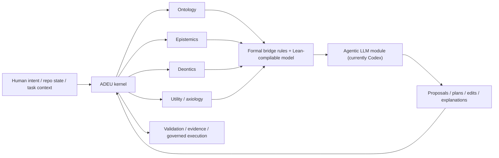

# Draft Externalized Reasoning Kernel v0

Status: working synthesis only (March 6, 2026 UTC).

This document captures the broader discussion behind the current module direction:

- why the kernel is treated as first-class rather than as a prompt appendix;
- why ADEU distinguishes ontology, epistemics, deontics, and utility/axiology;
- why explicit external structure is necessary for engineering-grade reasoning;
- why this matters for both human-AI interaction and AI autonomous work cycles.

This is not a lock doc. It does not authorize runtime behavior, release scope, or policy
changes.

## Core Thesis

Engineering-grade reasoning cannot be obtained by relying on the LLM path alone.

It requires two pillars:

- an external agentic module that generates proposals, inferences, plans, and edits;
- an externalized kernel that structures, constrains, validates, and records those moves.

In the current practical context, the external agentic module is Codex, accessed through the
Codex integration surface already available to the repo.

The kernel is ADEU's own structured pillar:

- typed artifacts;
- explicit authority boundaries;
- deterministic checks;
- verifier and evidence lanes;
- formal semantic and logical grounding;
- governed human-AI and AI-only execution cycles.

## Non-Goal

The point is not to build yet another editor clone.

The point is to embed the kernel directly inside interaction between:

- humans and AI;
- AI and repository state;
- AI and autonomous work cycles.

If this later becomes a plugin or integration surface inside a larger agent product, that is
compatible with the thesis. The kernel remains first-class either way.

## Why Prompt Prose Is Not Enough

Prompt files and `AGENTS.md`-style prose can guide behavior, but they are not strong enough
to function as the real reasoning substrate.

They do not by themselves provide:

- typed authority claims;
- explicit state transitions;
- deterministic validation;
- replayable evidence;
- formal separation between kinds of claims;
- machine-checkable justification structure.

So the kernel cannot be treated as a soft appendix around the model. If the thesis is serious,
the kernel must stand on its own terms.

## The Four-Lane Separation

ADEU's conceptual separation is:

1. ontology
2. epistemics
3. deontics
4. utility / axiology

These lanes should remain explicit and formally connected rather than being allowed to blur.

| Lane | Core question | Typical failure when implicit |
| --- | --- | --- |
| Ontology | what exists here? | entities, relations, and structure are misrepresented |
| Epistemics | what is known, justified, inferred, uncertain? | confidence, evidence, and warrant collapse |
| Deontics | what is required, allowed, forbidden, binding? | preferences and instructions masquerade as obligations |
| Utility / axiology | what is preferred, optimized, ranked, valuable? | optimization silently overrides constraints or facts |

## Why Explicit Lane Separation Matters

If these lanes remain implicit, they intermingle.

Typical pathologies:

- preferences masquerade as truths;
- observations masquerade as permissions;
- norms masquerade as facts;
- optimization goals silently override obligations;
- vague "reasoning quality" language replaces clear diagnosis.

This is one of the central reasons agent systems drift into chaos even when individual outputs
remain locally fluent.

The claim is not merely that explicit lanes are philosophically cleaner. The claim is that they
are operationally necessary for robust reasoning.

## Why Formalization Matters

The four-lane model is not meant to remain rhetorical.

Its importance is that the lane distinctions and their bridge rules can be represented in a
Lean-compilable logical model.

That changes the status of the thesis from:

- "we should think carefully about these distinctions"

to:

- "the system should declare which lane a claim belongs to and what bridge rules allow one
  lane to affect another"

That is the difference between philosophical commentary and a kernel with formal backbone.

## The LLM Plus Kernel Model

The important point is that the LLM is not the whole reasoning system.

The reasoning system is:

- LLM module;
- plus external kernel;
- plus explicit validation and evidence structure.

## What Counts as Success

The thesis has three proof obligations.

### 1. Philosophical coherence

The repo must sharply distinguish:

- what is authoritative;
- what is generated;
- what is known;
- what is binding;
- what is merely preferred;
- what counts as justified transition from one lane to another.

### 2. Operational embodiment

The kernel must actually mediate:

- planning;
- execution;
- verification;
- review;
- closeout;
- continuity to the next cycle.

If the kernel only appears in prose, then it remains commentary. If it owns the pipeline, it
becomes real.

### 3. Empirical advantage

The structured kernel should produce better practical results than a barebones GenAI flow.

Expected improvements:

- fewer silent reasoning failures;
- clearer auditability;
- stronger replayability;
- better long-horizon continuity;
- cleaner reviewability of what went wrong and why.

## Why This Changes Evaluation

Most current model comparisons reduce reasoning assessment to:

- benchmark tasks;
- aggregate percentages;
- expert impressions;
- broad narratives about which model "reasons better."

That is not useless, but it remains structurally thin.

With explicit lane separation, model evaluation can become qualitatively diagnostic.

Instead of saying:

- model X scored `82`
- model Y scored `86`

one can say:

- ontology failure: task structure was misrepresented;
- epistemic failure: certainty exceeded available warrant;
- deontic failure: authority boundary or obligation was violated;
- axiological failure: the wrong objective or priority ordering dominated.

Then the next questions become tractable:

- what bridge rule failed?
- why did it fail?
- what remediation is appropriate?
- why is that remediation sound?
- is the defect promptable, kernel-fixable, or model-intrinsic?

Without explicit lane separation, those questions collapse into vague statements like:

- "the model got confused"
- "the reasoning was weaker"
- "it followed instructions badly"

Those are not yet engineering-grade diagnoses.

## Practical Consequence for This Repo

This means the repo should keep treating the kernel as central infrastructure rather than as a
secondary wrapper around the model.

In practical terms:

- helper-only controls are not enough;
- authority boundaries must be pipeline-owned;
- evidence must be first-class;
- formal and operational layers must stay connected;
- the human-AI interaction surface should expose structure, not hide it.

## Relationship to Future ADEU Studio Work

The long-term direction is not "build a productized editor."

The direction is:

- internalize the kernel into actual interaction cycles;
- make governed human-AI and AI-only work possible inside ADEU Studio;
- preserve provider flexibility over time;
- keep the kernel first-class even if the agent surface later becomes a plugin inside some
  larger system.

Codex is the present external module of focus because it already has concrete integration
surfaces available. That does not reduce the generality of the thesis.

## Bottom Line

The thesis is that engineering-grade reasoning requires explicit external structure.

ADEU's wager is that:

- lane separation must be explicit;
- lane bridges must be formalizable;
- the kernel must be operational, not decorative;
- practical superiority should be demonstrated by better diagnosis, better continuity, and
  better governed outcomes than barebones LLM usage.

If that holds, then the kernel is not an appendix to the model.

It is one half of the reasoning system.
