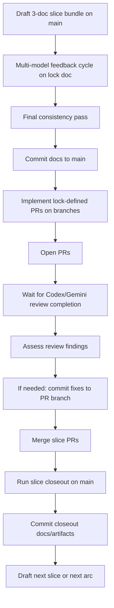

# Draft Practical Harness Flow v0

Status: working synthesis only (March 6, 2026 UTC).

This document captures the current slice workflow as it is actually practiced and the
near-term path for institutionalizing it inside the repo and, later, inside ADEU Studio.

This is not a lock doc. It does not authorize runtime behavior, release scope, or policy
changes.

## Purpose

- record the current practical flow for one arc slice;
- record the current practical flow for drafting a whole lane ladder before the first
  implementation slice starts;
- make the flow legible enough to later embed into a kernel-owned interaction cycle;
- distinguish the already-working operational pattern from the improvements still worth
  institutionalizing.

## Current Practical Arc-Ladder Rule

Before implementing the first slice of a newly selected family:

- draft the family architecture/decomposition docs first;
- draft the family-level implementation mapping first;
- draft the planned later-lane bundle notes first, even if only the first lane will be
  locked and implemented now;
- keep those later-lane bundles at `planning`, `architecture / decomposition`, or
  `support` authority until their turn arrives;
- do not silently treat drafted later-lane bundles as lock authority.

This up-front lane-ladder drafting exists to:

- force cross-lane coherence before code starts to drift the sequence;
- expose missing dependencies early rather than discovering them mid-implementation;
- keep later lanes shaped by the intended architecture rather than by accidental
  leftovers from the previous slice.

## Current Practical Slice Cycle

### 1. Draft the controlling slice bundle on `main`

For each slice, draft:

- the locked continuation doc;
- the stop-gate decision doc;
- the edges assessment doc.

Current feedback cycle for the lock doc:

1. GPT pass
2. either Opus then Gemini, or Gemini then Opus
3. second GPT pass
4. local consistency pass and updates
5. direct commit to `main`

This phase happens on `main` because the docs are the control plane for the slice.

Required doctrine hygiene during this phase:

- state the authority layer of each controlling doc explicitly:
  - lock
  - architecture / decomposition
  - planning
  - support
- use horizon-sensitive terms such as `bounded`, `complete`, `closed`, `deferred`,
  and `forbidden` consistently with
  `docs/DRAFT_INTENT_HORIZON_GLOSSARY_v0.md`;
- if a planning doc uses "not authorized by this planning draft", make clear that this
  is a planning-boundary scope guard rather than a lock-equivalent permanent
  prohibition;
- if the slice depends on "X may constrain Y but may not mint Y", enumerate the lawful
  constrain actions explicitly rather than leaving the boundary implicit.

### 2. Implement the slice as the lock defines it

- each PR starts from a fresh branch;
- PR boundaries follow the PR split stated in the lock doc;
- implementation happens in the PR branch;
- PR opens after the scoped implementation is complete.

### 3. Wait for inline bot review signals, then assess

Active bot reviewers for the implementation PRs:

- two Codex reviews;
- one Gemini review.

Operational nuance:

- review assessment should not start too early;
- if checked too early, only default `main` comments may be visible;
- Codex signals completion either by posting findings or by ending with a thumbs-up status;
- Gemini may either post findings or explicitly say it has no specific inline suggestions.

If review findings are worth addressing:

- fix them in the same PR branch;
- ideally do the assessment and the fixes in the same focused turn;
- commit the follow-up directly to that PR branch.

### 4. Run closeout on `main`

Once the slice PRs are merged:

- update the slice closeout docs/artifacts on `main`;
- current closeout bundle is:
  - one closeout markdown doc;
  - two JSON artifacts under `artifacts/`;
- commit the closeout update directly to `main`.

### 5. Run a pre-next-slice drift check, then repeat for the next slice

- compare the drafted next-lane bundle against what the previous implementation
  actually changed;
- classify each controlling assumption at least as:
  - `holds`
  - `amended`
  - `superseded`
  - `not_selected_anymore`
- if drift is immaterial, keep the drafted next-lane bundle and record a short
  confirmation update;
- if drift is material, revise the drafted next-lane bundle before locking it;
- then draft or refresh the next slice bundle if needed;
- implement the next slice PRs;
- close out the next slice;
- continue until the current arc is exhausted.

### 6. Draft the next big arc

After the current arc is complete:

- draft the next large arc in the same general docs-first style;
- continue the same pattern at the next planning layer.

## Current Flow In One View

## Why This Flow Already Works

- docs stay ahead of code rather than rationalizing code after the fact;
- slice scope is frozen before implementation;
- implementation stays broken into small PRs;
- review is not treated as optional commentary;
- closeout exists as a distinct step rather than being absorbed into the last PR;
- continuity from one slice to the next is maintained on `main`.

## What Is Worth Institutionalizing More Explicitly

### 1. An explicit lane-ladder drafting rule before first implementation

Before the first implementation slice of a selected family:

- draft the family architecture/decomposition docs;
- draft the family-wide implementation mapping;
- draft the later-lane bundle notes early enough that dependencies between lanes are
  already visible;
- keep later-lane bundles below lock authority until their turn arrives;
- record which later-lane assumptions are expected to be drift-sensitive.

This prevents later slices from being invented ad hoc after the earlier slice has
already constrained the shape accidentally.

### 2. An explicit readiness gate between drafting and implementation

Before any implementation PR starts, confirm:

- the three-doc bundle agrees on scope, exclusions, and acceptance;
- the bundle agrees on the authority layer of each cited doc;
- the PR split is frozen;
- deferred items are named explicitly;
- future seams are classified explicitly at least as:
  - instantiated_here
  - deferred_to_later_family
  - superseded_by_alternate_surface
  - not_selected_yet
- horizon-sensitive claims such as `complete`, `closed`, `deferred`, and `forbidden`
  are horizon-qualified rather than left to ambient interpretation;
- any "constrain but not mint" doctrine is translated into an explicit allowed-action
  list;
- any edge marked `resolved` is actually resolved in pipeline shape, not only in tests or
  helpers.

This is the first upgrade worth making formal.

### 3. A deterministic review-harvest gate

Do not start PR review assessment until the bot-review state is complete enough to trust.

Practical rule:

- Codex: findings posted or thumbs-up completion visible;
- Gemini: findings posted or explicit no-suggestions inline signal visible.

This should eventually be kernel-owned instead of being checked ad hoc.

### 4. A short pre-next-slice drift check against drafted later lanes

Before implementing the next drafted lane:

- compare the drafted lane bundle against the real results of the previous lane;
- mark each controlling assumption as:
  - `holds`
  - `amended`
  - `superseded`
  - `not_selected_anymore`
- revise the next lane only when drift is material rather than redrafting it from
  scratch every time.

This keeps the lane ladder coherent without freezing it unrealistically early.

### 5. Edge IDs carried across the whole slice lifecycle

If a slice has named open edges, those IDs should survive across:

- the lock doc;
- the PR descriptions;
- the review assessment;
- the closeout note;
- the residual cleanup tracker.

That makes it harder for edges to disappear semantically while remaining open operationally.

### 6. A stronger edge-status vocabulary

Not all "closed" states are equal.

Useful future split:

- `closed_in_pipeline`
- `closed_in_helper_or_tests_only`
- `deferred`

This prevents overclaiming completion when only a partial layer has landed.

### 7. A short pre-next-slice reality check

Before drafting the next lock:

- check whether the previous slice fully landed in the real pipeline;
- check whether closeout language overstated any adoption;
- check whether there is a thin hardening slice worth doing before scope expansion.

This is especially useful for slices that add new authority boundaries.

### 8. A doctrine-edge check before next-family selection

Before selecting a successor family:

- check whether planning-boundary text is being over-read as lock authority;
- check whether broader architecture-family seams have been explicitly classified as:
  - instantiated_here
  - deferred_to_later_family
  - superseded_by_alternate_surface
  - not_selected_yet;
- check whether any "working draft" doctrine surface is being relied on as active
  intent and, if so, whether that authority posture is stated plainly;
- check whether the future-family promotion posture is explicit:
  - stable substrate
  - bounded baseline likely to be extended
  - bounded baseline likely to be superseded

## What Institutionalization Should Mean

Institutionalization should not mean "more process text." It should mean that the workflow
becomes a kernel-owned, artifact-authoritative state machine.

Target properties:

- the slice has a clear state;
- transitions are explicit;
- required artifacts are known at each state;
- reviewer status is machine-readable;
- closeout evidence is generated and checked deterministically;
- next-slice readiness is explicit rather than socially inferred.

## Minimal Kernel-Owned Slice States

One reasonable future state model:

- `bundle_drafting`
- `feedback_in_progress`
- `bundle_consistent`
- `implementation_ready`
- `pr_open`
- `review_wait`
- `review_assessment`
- `merge_ready`
- `closeout_in_progress`
- `slice_closed`
- `next_slice_ready`

The point is not naming elegance. The point is replacing hidden workflow assumptions with
explicit governed transitions.

## ADEU Studio Implication

If this flow is eventually internalized inside ADEU Studio, Studio should not behave like a
generic editor clone.

The value is elsewhere:

- owning the three-doc slice bundle;
- tracking slice state;
- surfacing review readiness and findings;
- binding implementation PRs back to the lock;
- owning closeout generation and next-slice readiness.

The Studio surface should therefore be a governed workflow environment, not a thin wrapper
around text editing.

## Bottom Line

The current practical flow is already coherent and productive. What remains is to convert it
from a practiced discipline into an explicit kernel-owned lifecycle.

That conversion is the real institutionalization target.
