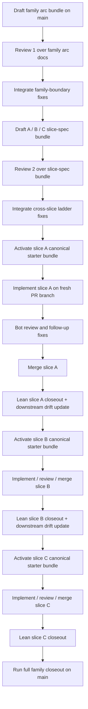

# Draft Practical Harness Flow v0

Status: working synthesis only (April 23, 2026 UTC).

This document captures the repo-native internal arc workflow as it is now intended
to be practiced by default, while preserving the older slice-serial method as a
supported fallback for unstable families.

This is not a lock doc. It does not authorize runtime behavior, release scope, or
policy changes by itself.

## Purpose

- record the active default practical flow for one family arc;
- preserve the older slice-serial flow as a still-allowed fallback;
- make the flow legible enough to later embed into a kernel-owned interaction
  cycle;
- distinguish family-planning authority from slice-lock authority;
- make closeout posture explicit at both the per-slice and full-family levels.

## Active Default: Family-Preplanned Workflow

The active repo-native default is now:

```text
draft family arc docs
-> review 1 over family arc docs
-> draft A / B / C slice specs
-> review 2 over the slice-spec bundle
-> for each slice, activate a canonical starter bundle
-> implement that slice as a separate PR
-> do lean slice closeout after each merged PR
-> do one full family closeout after the last merged slice
```

This is the default when the family boundary is already structurally clear.

## When The Default Applies

Use the family-preplanned workflow by default when all of the following are true:

- the family ladder is already clear enough to name `A`, `B`, and `C`;
- artifact names are stable enough to plan together;
- consumed-basis and package ownership are stable enough to plan together;
- later slices are expected to consume earlier slices rather than redefine the
  family architecture;
- the main remaining uncertainty is implementation detail, not family identity.

## When The Legacy Flow Is Still Better

The older slice-serial workflow remains allowed when:

- the family boundary is still being discovered;
- later slices may materially rename or reframe artifacts;
- evidence posture is still unstable;
- external review is likely to reshape the architecture after the first slice;
- the family is still exploratory enough that later slices would be mostly fake
  planning if drafted too early.

That fallback exists so the repo is not forced into premature pseudo-certainty.

## Current Practical Family-Preplanned Rule

Before implementing the first slice of a newly selected family:

- draft the selector / planning doc first;
- draft the family architecture / decomposition docs first;
- draft the family-level implementation mapping first;
- run review 1 over that family arc bundle before slice-spec drafting;
- draft all planned slice-spec docs for the family early, even if only the first
  slice will be lock-authoritative immediately;
- run review 2 over the `A/B/C` slice-spec bundle before starter-lock activation;
- if the family boundary and slice ladder are already stable, review 1 and review 2
  may be packaged as one joint external review bundle, but the reviewed artifacts
  must still distinguish family docs from slice specs;
- keep future-slice specs at `planning`, `architecture / decomposition`, or
  `support` authority until their turn arrives;
- do not silently treat drafted later-slice specs as lock authority;
- do not request extra external review between slices unless implementation drift
  materially changes the already reviewed slice ladder;
- do not silently collapse review 1 and review 2 unless the family is unusually
  small or obvious.

This up-front family drafting exists to:

- force cross-slice coherence before code starts to drift the sequence;
- expose missing dependencies early rather than discovering them mid-family;
- reduce repeated selector churn and repeated family restatement for each slice;
- let review 1 catch family-boundary and naming drift early;
- let review 2 catch cross-slice consumed-basis, ownership, and ladder drift
  before any slice lock is activated.

## Active Default Cycle

### 1. Draft the family arc bundle on `main`

Draft:

- the family selector / next-arc options doc;
- the family architecture / decomposition doc;
- the family-wide implementation mapping;
- any support-layer review companions that help shape the family.

Required doctrine hygiene during this phase:

- state the authority layer of each controlling doc explicitly:
  - lock
  - architecture / decomposition
  - planning
  - support
- keep future-slice specs below lock authority until they are actually activated;
- use horizon-sensitive terms such as `bounded`, `complete`, `closed`, `deferred`,
  and `forbidden` consistently with
  `docs/DRAFT_INTENT_HORIZON_GLOSSARY_v0.md`;
- if a planning doc uses "not authorized by this planning draft", make clear that
  this is a planning-boundary scope guard rather than a lock-equivalent permanent
  prohibition;
- if the family depends on "X may constrain Y but may not mint Y", enumerate the
  lawful constrain actions explicitly rather than leaving the boundary implicit.

### 2. Run review 1 over the family arc bundle

Before slice-spec drafting starts:

- run the external review cycle over the selector, family architecture, and
  family implementation mapping;
- integrate the worthwhile family-boundary fixes once at the family level;
- only after that treat the family arc docs as the current planning backbone.

The main purpose of this phase is to settle:

- family naming;
- consumed basis;
- package ownership;
- slice-ladder intent;
- boundary with adjacent families.

### 3. Draft the slice-spec bundle for `A`, `B`, and `C`

Draft:

- the planned slice spec for `A`;
- the planned slice spec for `B`;
- the planned slice spec for `C`;
- any support-layer review companions that help shape cross-slice coherence.

Important posture:

- these slice specs are implementation-adjacent planning docs, not lock authority;
- only the active slice will later receive lock / continuation authority;
- the expected active-slice starter bundle is:
  - `LOCKED_CONTINUATION_vNEXT_PLUS<n>.md`
  - `DRAFT_STOP_GATE_DECISION_vNEXT_PLUS<n>.md`
  - `ASSESSMENT_vNEXT_PLUS<n>_EDGES.md`
- later-slice specs remain revisable if earlier implementation teaches something
  material.

### 4. Run review 2 over the slice-spec bundle

Before starter-lock activation:

- run the external review cycle over the `A/B/C` slice-spec bundle;
- integrate the worthwhile cross-slice fixes while the family is still pre-code;
- freeze the family planning bundle as the current implementation-adjacent ladder.
- after this review is integrated, do not seek another external review for each
  slice by default; use the already reviewed slice specs unless lean closeout shows
  material drift.

The main purpose of this phase is to settle:

- slice ladder boundaries;
- artifact ownership across `A`, `B`, and `C`.

### 5. Activate the next slice with the minimum lock authority needed

For the slice currently being implemented:

- draft or refresh the controlling slice lock / continuation doc;
- draft or refresh any slice-local stop-gate / assessment docs needed for that
  slice;
- run the docs-only starter gate for docs/artifacts-only starter bundles, normally:
  - `make arc-start-check ARC=<n>`
- keep the rest of the family planning bundle intact unless real drift requires an
  update.

The important rule is:

- the family arc and slice-spec bundle are preplanned up front;
- only the current slice becomes lock-authoritative.

### 6. Implement the slice as a separate PR

- each slice still starts from a fresh branch;
- implementation happens in a dedicated slice PR;
- PR boundaries follow the family decomposition and the active slice lock;
- `A`, `B`, and `C` remain separate PRs even when the family was preplanned
  together and externally reviewed together.

### 7. Wait for inline bot review signals, then assess

Active bot reviewers for implementation PRs remain:

- two Codex reviews;
- one Gemini review.

Operational nuance:

- review assessment should not start too early;
- if checked too early, only default `main` comments may be visible;
- Codex signals completion either by posting findings or by ending with a thumbs-up
  status;
- Gemini may either post findings or explicitly say it has no specific inline
  suggestions.

If review findings are worth addressing:

- fix them in the same PR branch;
- ideally do the assessment and fixes in the same focused turn;
- commit the follow-up directly to that PR branch.

### 8. Run lean slice closeout on `main`

Once the slice PR is merged:

- update the slice status on `main`;
- update the slice closeout docs / artifacts only as much as needed to keep the
  sequence aligned;
- compare the already drafted downstream slice specs against the implementation that
  actually shipped;
- classify downstream assumptions at least as:
  - `holds`
  - `amended`
  - `superseded`
  - `not_selected_anymore`
- revise downstream slice docs only when drift is material.
- do not run the full family closeout at this point unless the slice is the final
  planned slice.

This is intentionally lean.

Its purpose is:

- continuity;
- drift correction;
- status advance;
- evidence alignment.

It is not the final family closeout.

### 9. Repeat for the next slice

- activate the next slice with the minimum lock-authoritative update needed;
- mint that slice's canonical starter bundle with its own lock, stop-gate decision,
  and edge assessment;
- implement on a fresh PR branch;
- run normal bot review;
- merge;
- run lean slice closeout / drift update;
- continue until the last planned slice is merged.

### 10. Run full family closeout after the last slice

After the final slice PR merges:

- update the family selector and family architecture status;
- update final family stop-gate / assessment docs;
- generate the closing artifacts for the family as a whole;
- mark the family closed on `main`.

The family closeout is the place for:

- full family judgment;
- final canonical closeout artifacts;
- final family status transition.

## Active Flow In One View



## Why This Default Is Better For Stable Families

- docs still stay ahead of code rather than rationalizing it after the fact;
- the family shape becomes coherent before slice implementation drifts it;
- review 1 can catch family-boundary problems early;
- review 2 can catch cross-slice problems before slice locks start to ship;
- slice PRs remain small and reviewable;
- per-slice continuity is preserved without doing a full family closeout three
  times;
- the family gets one final explicit closure point rather than three partial
  pseudo-closures.

## Legacy Fallback: Slice-Serial Workflow

The old workflow remains allowed as a legacy fallback.

### Legacy Use Case

Use it when the family is still exploratory enough that later slices would mostly
be speculative scaffolding.

### Legacy Shape

1. Draft the controlling slice bundle on `main`
2. Implement that slice on a fresh PR
3. Run bot review and fixes
4. Run slice closeout on `main`
5. Draft the next slice only after the previous one lands

This flow is still valid.
It is simply no longer the default when the family shape is already clear.

## Readiness Gate Before Implementation

Before any slice PR starts, confirm:

- review 1 and review 2 have both completed, unless a deliberate exception was
  made for an unusually small family or they were intentionally packaged as one
  joint external review bundle;
- the family bundle agrees on scope, exclusions, and acceptance;
- the active slice lock agrees with the family bundle on consumed / emitted scope;
- the PR split is frozen for the active slice;
- deferred items are named explicitly;
- future seams are classified explicitly at least as:
  - `instantiated_here`
  - `deferred_to_later_family`
  - `superseded_by_alternate_surface`
  - `not_selected_yet`
- horizon-sensitive claims such as `complete`, `closed`, `deferred`, and
  `forbidden` are horizon-qualified rather than left to ambient interpretation;
- any "constrain but not mint" doctrine is translated into an explicit
  allowed-action list;
- any downstream slice docs that remain from the family bundle are marked either:
  - `still_holds`
  - `needs_refresh_before_activation`.

## Review-Harvest Gate

Do not start PR review assessment until the bot-review state is complete enough to
trust.

Practical rule:

- Codex: findings posted or thumbs-up completion visible;
- Gemini: findings posted or explicit no-suggestions inline signal visible.

This should eventually be kernel-owned rather than checked ad hoc.

## Drift Discipline

The family-preplanned workflow works only if downstream drift stays explicit.

Before activating the next drafted slice:

- compare the drafted slice bundle against the real results of the previous slice;
- mark each controlling assumption as:
  - `holds`
  - `amended`
  - `superseded`
  - `not_selected_anymore`
- revise the next slice only when drift is material rather than redrafting the
  entire family from scratch every time.

## Edge-Carry Discipline

If a slice has named open edges, those IDs should survive across:

- the active slice lock;
- the PR descriptions;
- the review assessment;
- the lean slice closeout;
- the final family closeout.

That makes it harder for edges to disappear semantically while remaining open
operationally.

## Closeout Vocabulary

Not all "closed" states are equal.

Useful distinctions remain:

- `slice_closed_for_now`
- `family_closed`
- `closed_in_pipeline`
- `closed_in_helper_or_tests_only`
- `deferred`

This prevents overclaiming completion when only a partial layer has landed.

## Bottom Line

The active repo-native default is now:

- plan the whole family up front;
- draft all expected slice implementation specs up front;
- review the family and slice ladder before code;
- implement slices as separate PRs;
- mint a canonical starter bundle only for the active slice;
- keep per-slice closeout lean;
- close the whole family once at the end.

The older slice-serial workflow remains available, but it is now the fallback for
exploratory or unstable families rather than the default for all families.
