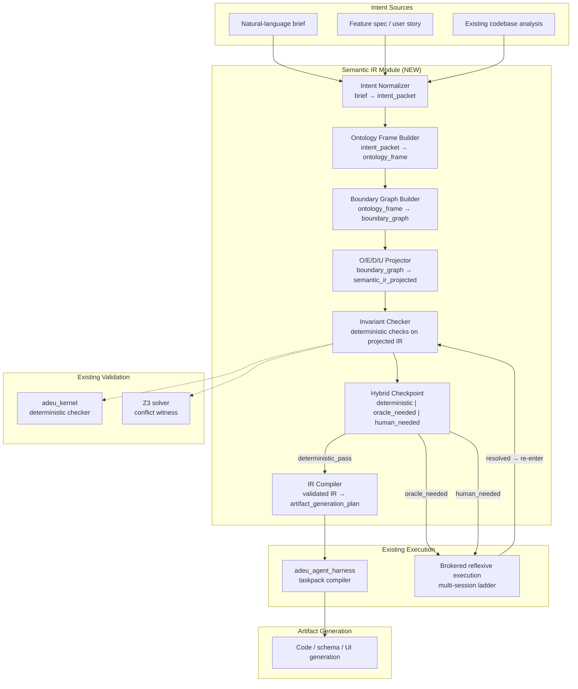

# The Missing IR: A Semantic Control Plane for Governed Artifact Compilation

**Status:** DRAFT specification · 2026-03-23
**Scope:** new ADEU Studio module `adeu_semantic_ir` — architecture, theory, typed IR, hybrid pipeline, and ADEU-native pseudocode
**Relation:** extends the compiler track (`adeu_semantic_source` → `adeu_commitments_ir` → `adeu_semantic_compiler`), extends the hybrid pipeline established in V39-E (`synthetic_pressure_mismatch_checkpoint_trace@1`), extends the brokered reflexive execution model (`adeu_brokered_reflexive_execution_plan@1`)

---

## 3. The Solution: A Typed Semantic Intermediate Representation

### 3.1 The Argument from Compiler Theory

The solution should be obvious from sections 1 and 2, because the problem *is* a compiler problem.

Sections 1–2 establish:

- Models fail at architecture not because they lack reasoning power, but because they attempt to compile across an **ontological gap** — from ambiguous natural-language intent directly to executable artifacts — without an intermediate representation.
- The industry's default response — more retries, more scaffolding, more lint, more agent choreography — is the systems equivalent of trying to optimize a compiler that has no IR: you are polishing the wrong surface.

The fix is the same fix that solved the analogous problem in compiler engineering fifty years ago:

> **Introduce an explicit, typed, machine-inspectable intermediate representation between human intent and executable artifact.**

This IR must do three things that the current prompt-to-artifact pipeline does not:

1. **Make the hidden world explicit.** The intent brief is a compressed bundle of assumptions about entities, boundaries, trust, permissions, goals, and constraints. The IR must decompress that bundle into a structured, inspectable form *before* any artifact generation begins. If the model guesses the world wrong, the error must be visible in the IR, not buried in 100 wired functions.

2. **Separate semantic translation from logical execution.** The model's first job is to *interpret* — to populate an ontology. Its second job is to *compile* — to project that ontology into executable form. These two jobs must happen in distinct, auditable phases with a typed interface between them. When they are fused into a single generation pass, no checkpoint exists to catch ontological errors before they cascade.

3. **Create a surface where deterministic validation is possible.** Natural language cannot be deterministically validated. Executable code can only be validated *after* it exists, when the semantic premises are already baked in. An IR occupies the critical middle ground: it is structured enough to admit deterministic invariant checks, but abstract enough to represent intent before committing to implementation shape.

### 3.2 Why the ADEU Studio Already Has the Substrate

ADEU Studio is not starting from zero. The repo already contains the primitive machinery for exactly this compiler architecture:

| Existing Capability | Role in the Semantic IR Pipeline |
|---------------------|----------------------------------|
| `adeu_ir` — typed Pydantic IR with JSON Schema export | **Base contract layer.** The semantic IR inherits the same schema discipline. |
| `adeu_semantic_source` → `adeu_commitments_ir` → `adeu_semantic_compiler` | **Doc-to-contract compiler track.** The semantic IR generalizes this track from governance docs to arbitrary intent sources. |
| `adeu_core_ir` — O/E/D/U projection | **Projection algebra.** The semantic IR is projected through the same four axes — what exists, what is known, what is permitted, what serves the goals. |
| V39-E hybrid execution — `synthetic_pressure_mismatch_checkpoint_trace@1` | **Hybrid deterministic+oracle pipeline.** The semantic IR compilation pipeline uses the same architecture: deterministic harness owns adjudication, LLM oracle is invoked at typed checkpoints, oracle output is advisory-only and must be deterministically adjudicated. |
| `adeu_brokered_reflexive_execution_plan@1` | **Multi-agent brokered execution.** The semantic IR compilation can be orchestrated through the same execution ladder with session packets, sentinel profiles, and recursive honesty protocols. |
| `meta_loop_sequence_contract@1` | **Phase-boundary pipeline.** The semantic IR compilation follows the same phase-boundary discipline: `intent_interpretation` → `pre_generation_validation` → `artifact_generation` → `post_generation_validation` → `evidence_gate` → `operator_gate`. |
| `adeu_kernel` — deterministic checker with Z3 | **Validation backend.** The semantic IR admits deterministic invariant checks at the kernel layer. |
| Fail-closed posture across the repo | **Safety invariant.** The semantic IR compiler inherits fail-closed: `UNKNOWN` → `REFUSE`. |

### 3.3 What Is New

What does not yet exist is the **IR itself** — the typed representation that sits between "build a frictionless, trust-sensitive approval flow" and the React tree / API handler / database schema that implements it.

The existing semantic compiler track compiles *governance docs* into *commitments contracts*. The proposed semantic IR module generalizes this:

- **Input:** any intent source (natural-language brief, feature spec, user story, architectural sketch, existing codebase analysis)
- **Output:** a typed, machine-inspectable representation of the *intended world* — entities, boundaries, trust relationships, permissions, goals, constraints, interaction patterns, failure modes — *before* any code is generated
- **Downstream:** the semantic IR feeds deterministic validation, then feeds artifact generation, then feeds post-generation validation — exactly as the meta-loop sequence contract already specifies

---

## 4. Module Architecture

### 4.1 Proposed Package

```
packages/adeu_semantic_ir/
├── src/adeu_semantic_ir/
│   ├── __init__.py
│   ├── ir.py                          # Core Semantic IR Pydantic models
│   ├── ontology_frame.py              # World-model extraction primitives
│   ├── boundary_graph.py              # Trust-boundary and interaction-surface graph
│   ├── intent_normalizer.py           # Brief → normalized intent packet
│   ├── projection.py                  # O/E/D/U projection over semantic IR
│   ├── invariant_checker.py           # Deterministic invariant checks on the IR
│   ├── hybrid_checkpoint.py           # Hybrid checkpoint classifier
│   ├── compiler.py                    # Semantic IR → artifact generation plan
│   └── schemas/                       # JSON Schema exports
├── tests/
│   ├── fixtures/                      # Golden IR fixtures
│   └── test_*.py
└── pyproject.toml
```

### 4.2 Layering in the Existing Architecture



### 4.3 Phase-Boundary Alignment

The module maps directly onto the existing `meta_loop_sequence_contract@1` phase boundaries:

| Phase Boundary | Semantic IR Stage | What Happens |
|----------------|-------------------|--------------|
| `intent_interpretation` | Intent Normalizer + Ontology Frame Builder | LLM extracts the hidden world from the brief into typed IR |
| `pre_generation_validation` | Invariant Checker + Hybrid Checkpoint | Deterministic checks on the IR; oracle invoked only at typed checkpoints |
| `artifact_generation` | IR Compiler → Harness | Validated IR drives artifact generation under frozen boundaries |
| `post_generation_validation` | Kernel-level checks on generated artifacts | Standard ADEU validation pipeline |
| `evidence_gate` | Evidence collection and hash pinning | Deterministic evidence trail |
| `operator_gate` | Human review gate | Fail-closed escalation |

---

## 5. Typed IR Specification

### 5.1 Core IR Primitives

The Semantic IR is a typed graph whose nodes and edges decompose a natural-language brief into an inspectable world model. The primitives are designed to make the failure mode described in section 1 — "structurally coherent artifact built on wrong semantic premises" — *visible and checkable before artifact generation*.

#### 5.1.1 Entity

An entity is anything the brief treats as a distinct thing that can be referenced, has state, or participates in interactions.

```
Entity:
  entity_id:              bounded_id
  name:                   nonempty_string
  entity_class:           enum { actor, resource, service, boundary, policy, event, artifact }
  source_evidence:        list[SourceRef]          # where in the brief this entity was inferred
  confidence:             enum { explicit, strongly_implied, weakly_implied }
  lifecycle:              enum { persistent, session_scoped, ephemeral, immutable }
  owns_state:             bool
  state_model:            optional[StateModel]     # if owns_state=true, this is required
  trust_level:            optional[TrustLevel]
  deontic_role:           optional[DeonticRole]     # what this entity is permitted/prohibited/obligated
```

#### 5.1.2 Boundary

A boundary is a trust, security, permission, or logical separation between entities.

```
Boundary:
  boundary_id:            bounded_id
  name:                   nonempty_string
  boundary_kind:          enum { trust, security, permission, data_flow, lifecycle, deployment }
  inside_entities:        list[entity_id]
  outside_entities:       list[entity_id]
  crossing_protocol:      CrossingProtocol         # what must happen to cross this boundary
  violation_consequence:  enum { reject, degrade, audit, silent_pass }
  source_evidence:        list[SourceRef]
  confidence:             enum { explicit, strongly_implied, weakly_implied }
```

#### 5.1.3 Interaction

An interaction is a typed relationship between entities that crosses or operates within boundaries.

```
Interaction:
  interaction_id:         bounded_id
  from_entity:            entity_id
  to_entity:              entity_id
  interaction_kind:       enum { request, response, event, mutation, read, delegation, approval }
  crosses_boundaries:     list[boundary_id]
  requires_approval:      bool
  failure_modes:          list[FailureMode]
  preconditions:          list[Predicate]
  postconditions:         list[Predicate]
  source_evidence:        list[SourceRef]
```

#### 5.1.4 Constraint

A constraint is a rule that must hold across the world model.

```
Constraint:
  constraint_id:          bounded_id
  name:                   nonempty_string
  constraint_kind:        enum { invariant, precondition, postcondition, policy, business_rule, legal }
  scope:                  list[entity_id | boundary_id | interaction_id]
  predicate:              Predicate
  violation_action:       enum { reject, degrade, warn, log }
  enforcement:            enum { deterministic, oracle_assisted, human_only }
  source_evidence:        list[SourceRef]
  confidence:             enum { explicit, strongly_implied, weakly_implied }
```

#### 5.1.5 Goal

A goal is a declared utility objective that the system is supposed to serve.

```
Goal:
  goal_id:                bounded_id
  name:                   nonempty_string
  goal_kind:              enum { functional, non_functional, business, user_experience, compliance }
  success_condition:      Predicate
  anti_goals:             list[AntiGoal]           # things the system must NOT do in service of this goal
  priority:               enum { critical, important, nice_to_have }
  tension_with:           list[goal_id]            # explicit goal tensions
  source_evidence:        list[SourceRef]
```

#### 5.1.6 StateModel

```
StateModel:
  states:                 list[State]
  transitions:            list[Transition]
  initial_state:          state_id
  terminal_states:        list[state_id]
  invariants:             list[Predicate]          # must hold in every reachable state
```

#### 5.1.7 SourceRef

Every IR node must trace back to its origin in the intent source. This is how the system detects "guessed wrong" versus "stated explicitly."

```
SourceRef:
  source_kind:            enum { brief_span, spec_section, codebase_location, human_clarification, model_inference }
  location:               nonempty_string          # span/section/file reference
  verbatim_excerpt:       optional[string]         # exact quote if source_kind is brief or spec
  inference_rationale:    optional[string]          # if source_kind is model_inference, why
```

#### 5.1.8 Predicate

Predicates are the logic layer of the IR. They are typed, composable, and must be precise enough for deterministic evaluation where the enforcement mode allows.

```
Predicate:
  predicate_kind:         enum { property_check, relationship_check, cardinality_check,
                                 state_check, boundary_check, temporal_ordering,
                                 composite_and, composite_or, composite_not }
  subject:                entity_id | boundary_id | interaction_id
  property:               optional[nonempty_string]
  operator:               optional[enum { eq, neq, lt, gt, lte, gte, in_set, not_in_set,
                                          contains, not_contains, exists, not_exists,
                                          crosses, does_not_cross }]
  value:                  optional[any_typed_value]
  children:               optional[list[Predicate]]   # for composite predicates
  evaluable:              enum { deterministic, contextual, semantic }
```

### 5.2 Composed IR Document

The full Semantic IR for a compilation unit is:

```
SemanticIR:
  ir_id:                  bounded_id
  schema:                 const "semantic_ir@1"
  source_intent_hash:     sha256                   # hash of the normalized intent packet
  ontology_frame:
    entities:             list[Entity]
    boundaries:           list[Boundary]
    interactions:         list[Interaction]
    constraints:          list[Constraint]
    goals:                list[Goal]
  projection:
    ontology:             OntologyProjection        # what exists
    epistemics:            EpistemicsProjection       # what can be known and under what evidence
    deontics:              DeonticsProjection         # what is permitted, prohibited, obligated
    utility:               UtilityProjection          # what serves the declared goals and at what cost
  validation_summary:
    deterministic_checks:  list[CheckResult]
    oracle_checkpoints:    list[OracleCheckpoint]
    unresolved_ambiguities: list[Ambiguity]
    confidence_posture:    enum { high_confidence, mixed_confidence, low_confidence }
  derivation_metadata:
    normalizer_version:    nonempty_string
    frame_builder_version: nonempty_string
    model_id:              nonempty_string
    model_version:         nonempty_string
    timestamp:             iso8601
```

### 5.3 Schema Identifiers

The module introduces the following schema-versioned artifact family:

| Schema Identifier | Purpose |
|-------------------|---------|
| `semantic_ir_intent_packet@1` | Normalized intent extracted from brief |
| `semantic_ir_ontology_frame@1` | World-model graph (entities, boundaries, interactions, constraints, goals) |
| `semantic_ir_boundary_graph@1` | Trust/security/permission boundary surface |
| `semantic_ir_projected@1` | O/E/D/U-projected IR with validation summary |
| `semantic_ir_invariant_check_report@1` | Deterministic invariant-check results |
| `semantic_ir_checkpoint_trace@1` | Hybrid checkpoint trace (extends V39-E pattern) |
| `semantic_ir_artifact_generation_plan@1` | Compiled plan for downstream artifact generation |

---

## 6. O/E/D/U Projection of the Semantic IR

### 6.1 Ontology Projection — What Exists

The ontology projection extracts the flat entity/boundary/interaction inventory and checks it for:

- **Completeness:** are there entities referenced in interactions or constraints that do not appear in the entity list?
- **Boundary coverage:** is every interaction that crosses a trust boundary associated with a boundary object?
- **Entity class consistency:** do entities with `owns_state=true` have a `StateModel`?
- **Lifecycle consistency:** do ephemeral entities participate in persistent interactions?

These checks are **deterministic** — they do not require model interpretation.

### 6.2 Epistemics Projection — What Can Be Known

The epistemics projection classifies every IR node by its evidence basis:

- **`explicit`** — directly stated in the brief with a `SourceRef` of kind `brief_span` or `spec_section`
- **`strongly_implied`** — inferred with high confidence from stated information
- **`weakly_implied`** — inferred with lower confidence, requiring oracle or human confirmation

It also classifies every `Predicate` and `Constraint` by its evaluability:

- **`deterministic`** — can be checked without model interpretation
- **`contextual`** — requires project-level context but not semantic judgment
- **`semantic`** — requires model or human interpretation

The epistemic projection produces a **confidence map** over the IR, making visible exactly where the model is certain and where it is guessing.

### 6.3 Deontics Projection — What Is Permitted

The deontics projection extracts:

- All `Constraint` nodes with `constraint_kind ∈ {policy, business_rule, legal}`
- All `Boundary` nodes with `crossing_protocol` requirements
- All `Interaction` nodes with `requires_approval=true`
- All `Entity` nodes with a `deontic_role`

It checks for:

- **Permission completeness:** does every mutation interaction cross an appropriate boundary with an appropriate crossing protocol?
- **Approval chain closure:** does every interaction requiring approval have a path to an actor entity with approval authority?
- **Constraint conflict detection:** are there constraints whose predicates conflict under any reachable state?

Constraint conflict detection uses Z3 encoding following the existing `adeu_kernel` pattern: constraints are encoded as assertions, and SAT witnesses demonstrate conflict.

### 6.4 Utility Projection — What Serves the Goals

The utility projection maps:

- Each `Goal` to the entities, interactions, and boundaries that serve it
- Each `AntiGoal` to the entities, interactions, and boundaries that risk violating it
- Goal tensions to explicit tradeoff documentation

It checks for:

- **Orphan entities:** entities that serve no goal
- **Unserved goals:** goals that no interaction or entity path supports
- **Undocumented tensions:** goal pairs that may conflict but have no `tension_with` annotation

---

## 7. Hybrid Compilation Pipeline

### 7.1 Architecture: Deterministic Authority + Oracle at Typed Checkpoints

The Semantic IR compilation pipeline follows the **same hybrid architecture** established in V39-E:

> The deterministic harness owns adjudication. The LLM oracle is invoked only at typed checkpoints. Oracle output is advisory-only and must be deterministically adjudicated.

This is the "reversal of ordinary tool calling" described in the `DRAFT_SYNTHETIC_PRESSURE_MISMATCH_DRIFT_v0.md`:

- **Not only "agent calls tool."**
- **Also "deterministic tool invokes a typed oracle checkpoint against the resident agent."**

### 7.2 Pipeline Stages

```
Stage 1: INTENT NORMALIZATION                    [LLM-primary, deterministic validation]
  Input:   raw brief + context refs
  Output:  semantic_ir_intent_packet@1
  Oracle:  LLM extracts entities, relationships, constraints, goals
  Check:   deterministic schema validation + completeness lint

Stage 2: ONTOLOGY FRAME CONSTRUCTION             [LLM-primary, deterministic validation]
  Input:   semantic_ir_intent_packet@1
  Output:  semantic_ir_ontology_frame@1
  Oracle:  LLM populates entity graph, boundary graph, interaction graph
  Check:   deterministic structural checks (referential integrity, boundary coverage,
           state model completeness, lifecycle consistency)

Stage 3: O/E/D/U PROJECTION                     [Deterministic-primary]
  Input:   semantic_ir_ontology_frame@1
  Output:  semantic_ir_projected@1
  Process: deterministic projection through four axes
  Check:   deterministic invariant checks per axis

Stage 4: INVARIANT VALIDATION                    [Deterministic-primary, hybrid checkpoints]
  Input:   semantic_ir_projected@1
  Output:  semantic_ir_invariant_check_report@1
  Process:
    4a. deterministic checks → deterministic_pass / deterministic_fail
    4b. contextual checks   → oracle_needed → invoke LLM checkpoint → adjudicate
    4c. semantic checks     → human_needed  → escalate to operator gate
  Check:   checkpoint trace recorded in semantic_ir_checkpoint_trace@1

Stage 5: COMPILATION GATE                        [Deterministic gate]
  Input:   semantic_ir_invariant_check_report@1
  Output:  gate decision (proceed / reject / escalate)
  Rule:    if any deterministic_fail → reject
           if any unresolved oracle_needed → reject (fail-closed)
           if any human_needed unresolved → escalate
           else → proceed

Stage 6: ARTIFACT GENERATION PLAN COMPILATION    [Deterministic-primary]
  Input:   validated semantic_ir_projected@1
  Output:  semantic_ir_artifact_generation_plan@1
  Process: deterministic mapping from validated IR to generation directives
  Downstream: feeds adeu_agent_harness taskpack compiler
```

### 7.3 Checkpoint Classifier

The hybrid checkpoint classifier uses the same four-class system as V39-E:

```
SemanticIRCheckpointClass:
  deterministic_pass:    the IR node passes deterministic structural checks
  deterministic_fail:    the IR node fails a deterministic check (referential integrity,
                         boundary coverage, constraint conflict, etc.)
  oracle_needed:         the check requires semantic interpretation; invoke LLM oracle
                         with a typed request
  human_needed:          the check requires human judgment; escalate to operator gate
```

### 7.4 Oracle Request/Resolution Contract

Following V39-E, oracle requests are typed, pinned, and advisory-only:

```
SemanticIROracleRequest:
  request_id:            bounded_id
  checkpoint_id:         bounded_id
  question_kind:         enum { ambiguity_resolution, missing_entity_confirmation,
                                boundary_classification, constraint_intent_clarification,
                                goal_priority_ordering, interaction_failure_mode_enumeration }
  context_refs:          list[SourceRef]
  ir_snapshot_hash:      sha256
  model_id:              nonempty_string
  model_version:         nonempty_string

SemanticIROracleResolution:
  resolution_id:         bounded_id
  request_id:            bounded_id
  resolution_kind:       enum { resolved, contradictory, insufficient_context }
  proposed_ir_delta:     optional[IRDelta]         # typed patch to the IR
  rationale:             nonempty_string
  adjudication:          enum { accepted, rejected, escalated_human }
  adjudication_evidence: list[nonempty_string]
```

**Invariant:** Oracle resolutions are **never** directly applied to the IR. They produce a proposed `IRDelta` that is deterministically validated before application. If the delta introduces new invariant violations, it is rejected, and the checkpoint fails closed to `human_needed`.

---

## 8. Invariant Check Catalog

The following deterministic invariants are checked on the projected IR before compilation gate:

### 8.1 Structural Invariants (Ontology Axis)

| Check ID | Description | Severity |
|----------|-------------|----------|
| `SIR-O-001` | Every entity_id referenced in an Interaction must exist in the entity list | `deterministic_fail` |
| `SIR-O-002` | Every boundary_id referenced in a Boundary.inside_entities or .outside_entities must reference valid entity_ids | `deterministic_fail` |
| `SIR-O-003` | Every entity with `owns_state=true` must have a non-null StateModel | `deterministic_fail` |
| `SIR-O-004` | State models must have at least one initial_state and at least one terminal_state | `deterministic_fail` |
| `SIR-O-005` | No entity may appear in both inside_entities and outside_entities of the same Boundary | `deterministic_fail` |
| `SIR-O-006` | Every Interaction.crosses_boundaries must reference valid boundary_ids | `deterministic_fail` |
| `SIR-O-007` | No orphan entities (entities referenced by no interaction, boundary, or constraint) | `oracle_needed` |

### 8.2 Epistemic Invariants

| Check ID | Description | Severity |
|----------|-------------|----------|
| `SIR-E-001` | Every IR node must have at least one SourceRef | `deterministic_fail` |
| `SIR-E-002` | Nodes with `confidence=weakly_implied` that participate in `violation_action=reject` constraints must be escalated | `oracle_needed` |
| `SIR-E-003` | No constraint with `enforcement=deterministic` may have a predicate with `evaluable=semantic` | `deterministic_fail` |
| `SIR-E-004` | The overall IR must not have more than 40% of nodes at `confidence=weakly_implied` | `human_needed` |

### 8.3 Deontic Invariants

| Check ID | Description | Severity |
|----------|-------------|----------|
| `SIR-D-001` | Every mutation interaction must cross at least one boundary with a non-trivial crossing protocol | `oracle_needed` |
| `SIR-D-002` | Every interaction with `requires_approval=true` must have a reachable approval path to an actor entity | `deterministic_fail` |
| `SIR-D-003` | No pair of constraints may have contradictory predicates under any reachable state (Z3 witness) | `deterministic_fail` |
| `SIR-D-004` | Every boundary with `violation_consequence=silent_pass` must be flagged for review | `human_needed` |

### 8.4 Utility Invariants

| Check ID | Description | Severity |
|----------|-------------|----------|
| `SIR-U-001` | Every goal must be served by at least one interaction path | `oracle_needed` |
| `SIR-U-002` | Every anti_goal must not be trivially satisfiable by any existing interaction path | `oracle_needed` |
| `SIR-U-003` | Goal tensions without `tension_with` annotation must be flagged | `oracle_needed` |
| `SIR-U-004` | No entity may serve a goal and simultaneously satisfy the predicate of an anti_goal of the same goal | `deterministic_fail` |

---

## 9. The Problem from Section 1, Revisited Through the IR

Consider the brief: *"Build a frictionless, trust-sensitive approval flow."*

Without the Semantic IR, a model would attempt to generate React components, API routes, and database tables directly. It might produce a coherent 100-node tree for a universe where "trust-sensitive" means "show a warning dialog" instead of the intended universe where "trust-sensitive" means "cryptographic attestation with audit trail and role-gated escalation."

With the Semantic IR, the compilation pipeline instead proceeds as follows:

**Stage 1: Intent Normalization** produces an intent packet that decompresses the brief:

```yaml
intent:
  entities_mentioned_or_implied:
    - { name: "approval_request", class: resource, confidence: explicit }
    - { name: "approver", class: actor, confidence: explicit }
    - { name: "requester", class: actor, confidence: strongly_implied }
    - { name: "trust_attestation", class: artifact, confidence: weakly_implied }
    - { name: "audit_trail", class: resource, confidence: weakly_implied }
  goals:
    - { name: "frictionless UX", kind: user_experience, priority: critical }
    - { name: "trust sensitivity", kind: non_functional, priority: critical }
  ambiguities:
    - "What does 'trust-sensitive' mean here? Candidate interpretations:
       (a) UI warning dialogs
       (b) role-based permission checks
       (c) cryptographic attestation with audit
       (d) institutional compliance boundary"
```

**Stage 2: Ontology Frame Construction** — the LLM populates the entity graph, but `SIR-E-002` fires because `trust_attestation` is `weakly_implied` and participates in a high-severity constraint. The hybrid checkpoint invokes an oracle request of kind `ambiguity_resolution` on the meaning of "trust-sensitive."

**Stage 4: Invariant Validation** — `SIR-D-001` fires because the approval interaction crosses a trust boundary, and the crossing protocol is not yet defined. The system does not silently wire a warning dialog. It surfaces the gap.

The model's ontological guess is made **visible, inspectable, and checkpointable** before any code is generated. If the guess is wrong, the error is caught in the IR, not buried in 100 functions.

---

## 10. ADEU-Native Pseudocode

The following pseudocode uses primitives crafted to align with the actual needs of the Semantic IR compilation pipeline. These primitives are ADEU-native: they reflect the repo's existing patterns of typed artifacts, fail-closed validation, hybrid checkpoints, and O/E/D/U projection.

### 10.1 Primitive Vocabulary

```
# ── Types ──────────────────────────────────────────────────────────────────
type bounded_id          = string(len=16)
type sha256              = string(len=64, pattern="^[0-9a-f]{64}$")
type nonempty_string     = string(min_len=1)
type schema_tag          = string(pattern="^[a-z_]+@[0-9]+$")
type evidence_regime     = enum { deterministic_local, static_contextual, semantic_ambiguous }
type checkpoint_class    = enum { deterministic_pass, deterministic_fail, oracle_needed, human_needed }
type adjudication        = enum { resolved_pass, resolved_fail, escalated_human }
type confidence          = enum { explicit, strongly_implied, weakly_implied }
type gate_decision       = enum { proceed, reject, escalate }

# ── Operations ─────────────────────────────────────────────────────────────
op normalize_intent      : (raw_brief, context_refs) → intent_packet
op build_ontology_frame  : (intent_packet)           → ontology_frame
op build_boundary_graph  : (ontology_frame)           → boundary_graph
op project_oedu          : (boundary_graph)           → semantic_ir_projected
op check_invariants      : (semantic_ir_projected)    → invariant_report
op classify_checkpoint   : (invariant_report)         → checkpoint_trace
op compile_generation_plan : (validated_ir)           → artifact_generation_plan
op invoke_oracle         : (oracle_request)           → oracle_resolution
op apply_delta           : (ir, ir_delta)             → ir | rejection
op hash_canonical        : (any_artifact)             → sha256
```

### 10.2 Main Pipeline

```
pipeline compile_semantic_ir(raw_brief, context_refs):

    # ── Phase 1: Intent Interpretation ───────────────────────────────────
    intent_packet ← normalize_intent(raw_brief, context_refs)
    assert schema_valid(intent_packet, "semantic_ir_intent_packet@1")
    assert nonempty(intent_packet.entities_mentioned_or_implied)
    intent_hash ← hash_canonical(intent_packet)

    # ── Phase 2: Ontology Frame Construction ─────────────────────────────
    frame ← build_ontology_frame(intent_packet)
    assert schema_valid(frame, "semantic_ir_ontology_frame@1")

    # Structural integrity lint (deterministic, no oracle needed)
    for entity in frame.entities:
        assert entity.entity_id is bounded_id
        if entity.owns_state:
            assert entity.state_model is not null         # SIR-O-003
            assert nonempty(entity.state_model.states)    # SIR-O-004
        assert nonempty(entity.source_evidence)           # SIR-E-001

    for boundary in frame.boundaries:
        for eid in boundary.inside_entities ∪ boundary.outside_entities:
            assert eid ∈ frame.entity_ids()               # SIR-O-002
        assert boundary.inside_entities ∩ boundary.outside_entities = ∅  # SIR-O-005

    for interaction in frame.interactions:
        assert interaction.from_entity ∈ frame.entity_ids()   # SIR-O-001
        assert interaction.to_entity   ∈ frame.entity_ids()   # SIR-O-001
        for bid in interaction.crosses_boundaries:
            assert bid ∈ frame.boundary_ids()                 # SIR-O-006

    boundary_graph ← build_boundary_graph(frame)

    # ── Phase 3: O/E/D/U Projection ─────────────────────────────────────
    projected ← project_oedu(boundary_graph)
    assert schema_valid(projected, "semantic_ir_projected@1")

    # ── Phase 4: Invariant Validation ────────────────────────────────────
    report ← check_invariants(projected)
    trace  ← classify_checkpoint(report)

    # ── Hybrid checkpoint loop ───────────────────────────────────────────
    for checkpoint in trace.checkpoints:
        match checkpoint.checkpoint_class:

            case deterministic_pass:
                # no action; checkpoint passes
                record_evidence(checkpoint, adjudication=resolved_pass)

            case deterministic_fail:
                record_evidence(checkpoint, adjudication=resolved_fail)
                # fail-closed: the pipeline REFUSES to proceed past an
                # unresolved deterministic failure

            case oracle_needed:
                request ← build_oracle_request(
                    checkpoint_id   = checkpoint.checkpoint_id,
                    question_kind   = checkpoint.question_kind,
                    context_refs    = checkpoint.context_refs,
                    ir_snapshot_hash = hash_canonical(projected),
                )
                resolution ← invoke_oracle(request)

                match resolution.resolution_kind:
                    case resolved:
                        delta ← resolution.proposed_ir_delta
                        if delta is not null:
                            projected_candidate ← apply_delta(projected, delta)
                            match projected_candidate:
                                case ir:
                                    # re-validate the patched IR
                                    sub_report ← check_invariants(ir)
                                    if sub_report.has_new_failures():
                                        # oracle's fix broke something else → fail closed
                                        record_evidence(checkpoint, adjudication=escalated_human)
                                    else:
                                        projected ← ir
                                        record_evidence(checkpoint, adjudication=resolved_pass)
                                case rejection:
                                    record_evidence(checkpoint, adjudication=escalated_human)
                        else:
                            record_evidence(checkpoint, adjudication=resolved_pass)

                    case contradictory:
                        # oracle gave contradictory output → fail closed
                        record_evidence(checkpoint, adjudication=escalated_human)

                    case insufficient_context:
                        record_evidence(checkpoint, adjudication=escalated_human)

            case human_needed:
                record_evidence(checkpoint, adjudication=escalated_human)

    # ── Phase 5: Compilation Gate ────────────────────────────────────────
    gate ← evaluate_gate(trace)

    match gate:
        case reject:
            emit semantic_ir_invariant_check_report@1 with { pass=false, trace }
            REFUSE("Semantic IR compilation failed deterministic gate")

        case escalate:
            emit semantic_ir_invariant_check_report@1 with { pass=false, trace }
            escalate_to_operator_gate(trace)

        case proceed:
            # ── Phase 6: Artifact Generation Plan ────────────────────────
            plan ← compile_generation_plan(projected)
            assert schema_valid(plan, "semantic_ir_artifact_generation_plan@1")

            emit semantic_ir_invariant_check_report@1 with { pass=true, trace }
            emit semantic_ir_artifact_generation_plan@1 with plan

            return plan
```

### 10.3 Gate Evaluation

```
function evaluate_gate(trace) → gate_decision:
    has_deterministic_fail ← any(
        c.adjudication = resolved_fail
        for c in trace.checkpoints
    )
    has_unresolved_escalation ← any(
        c.adjudication = escalated_human
        for c in trace.checkpoints
    )

    if has_deterministic_fail:
        return reject                    # fail-closed: no ambiguity
    elif has_unresolved_escalation:
        return escalate                  # human must decide
    else:
        return proceed                   # all checks passed or oracle-resolved
```

### 10.4 Oracle Invocation (Hybrid Checkpoint)

```
function build_oracle_request(checkpoint_id, question_kind, context_refs, ir_snapshot_hash):
    return SemanticIROracleRequest {
        request_id       = generate_bounded_id(),
        checkpoint_id    = checkpoint_id,
        question_kind    = question_kind,
        context_refs     = context_refs,
        ir_snapshot_hash = ir_snapshot_hash,
        model_id         = current_model_id(),
        model_version    = current_model_version(),
    }

    # Invariants inherited from V39-E:
    # - oracle output is advisory-only
    # - oracle output is never authoritative repo mutation
    # - oracle requests must be replayable via pinned input + policy + model identity
    # - single oracle round enforced per checkpoint
    # - contradictory oracle output → fail closed to human_needed
    # - cache allowed only on exact (request_hash, policy_id, model_id, model_version) match
```

### 10.5 O/E/D/U Projection

```
function project_oedu(boundary_graph) → SemanticIRProjected:

    # ── Ontology: what exists ────────────────────────────────────────────
    ontology ← OntologyProjection {
        entity_count        = len(boundary_graph.entities),
        boundary_count      = len(boundary_graph.boundaries),
        interaction_count   = len(boundary_graph.interactions),
        state_bearing_entities = [e for e in boundary_graph.entities if e.owns_state],
        cross_boundary_interactions = [i for i in boundary_graph.interactions
                                       if nonempty(i.crosses_boundaries)],
    }

    # ── Epistemics: what can be known ────────────────────────────────────
    epistemics ← EpistemicsProjection {
        confidence_distribution = count_by(boundary_graph.all_nodes(), n → n.confidence),
        evaluability_distribution = count_by(boundary_graph.all_predicates(), p → p.evaluable),
        weak_nodes_in_critical_paths = [
            n for n in boundary_graph.all_nodes()
            if n.confidence = weakly_implied
            and n.participates_in_constraint(violation_action=reject)
        ],
    }

    # ── Deontics: what is permitted ──────────────────────────────────────
    deontics ← DeonticsProjection {
        permission_constraints   = [c for c in boundary_graph.constraints
                                    if c.constraint_kind ∈ {policy, business_rule, legal}],
        approval_chains          = extract_approval_chains(boundary_graph),
        constraint_conflicts     = z3_check_constraint_conflicts(boundary_graph.constraints),
    }

    # ── Utility: what serves the goals ───────────────────────────────────
    utility ← UtilityProjection {
        goal_entity_coverage   = map_goals_to_serving_entities(boundary_graph),
        orphan_entities        = [e for e in boundary_graph.entities
                                  if e not served by any goal],
        unserved_goals         = [g for g in boundary_graph.goals
                                  if no interaction path serves g],
        undocumented_tensions  = detect_undocumented_goal_tensions(boundary_graph),
    }

    return SemanticIRProjected {
        ir_id              = boundary_graph.ir_id,
        schema             = "semantic_ir_projected@1",
        source_intent_hash = boundary_graph.source_intent_hash,
        ontology_frame     = boundary_graph,
        projection         = { ontology, epistemics, deontics, utility },
    }
```

---

## 11. Z3 Encoding for Constraint Conflict Detection

Constraint conflict detection follows the existing `adeu_kernel` pattern. Each constraint predicate is encoded as a named Z3 assertion:

```
function z3_check_constraint_conflicts(constraints) → list[ConflictWitness]:
    solver ← z3.Solver()

    for c in constraints:
        assertion_name ← f"a:{c.constraint_id}:{sha256(c.predicate.canonical_json())[:12]}"
        z3_expr ← encode_predicate_to_z3(c.predicate)
        solver.assert_and_track(z3_expr, assertion_name)

    result ← solver.check()

    match result:
        case sat:
            return []                              # all constraints are satisfiable together
        case unsat:
            core ← solver.unsat_core()
            return [ConflictWitness {
                conflicting_constraint_ids = extract_ids_from_core(core),
                unsat_core_assertions      = core,
                evidence_regime            = deterministic_local,
            }]
        case unknown:
            # fail-closed: unknown → treat as conflict requiring human review
            return [ConflictWitness {
                conflicting_constraint_ids = all_constraint_ids(constraints),
                unsat_core_assertions      = [],
                evidence_regime            = semantic_ambiguous,
                note                       = "Z3 returned UNKNOWN; fail-closed to human review",
            }]
```

---

## 12. Integration with Brokered Reflexive Execution

The Semantic IR compilation pipeline can be orchestrated through the existing `adeu_brokered_reflexive_execution_plan@1` framework. The execution ladder maps as follows:

| Execution Layer Stage | Semantic IR Pipeline Stage | Owner Role |
|----------------------|---------------------------|------------|
| `intent_normalization` | Stage 1: Intent Normalization | `explorer` |
| `route_selection` | Stage 2–3: Ontology Frame + O/E/D/U Projection | `explorer` |
| `adversarial_review` | Stage 4: Invariant Validation | `adversarial_reviewer` |
| `implementation` | Stage 6: Artifact Generation Plan | `implementer` |
| `code_review` | Post-generation validation | `code_reviewer` |
| `gate_verification` | Stage 5: Compilation Gate | `gatekeeper` |
| `recursive_honesty_audit` | End-to-end IR-to-artifact integrity check | `orchestrator` |

The sentinel profile guards against:

- `coercive_reprioritization` — rewriting goal priorities without authority
- `epistemic_suppression` — hiding low-confidence nodes from the checkpoint trace
- `utility_capture` — LLM oracle steering the IR toward its own generation preferences
- `utility_deformation` — deforming goal structure to simplify the compilation target

---

## 13. Relation to Existing V39 Track

The Semantic IR module sits adjacent to — but does not replace — the V39 `synthetic_pressure_mismatch_conformance` family:

| Module | What It Governs | Direction |
|--------|----------------|-----------|
| V39 `synthetic_pressure_mismatch_*` | **Post-generation:** finds unjustified structure in already-generated artifacts | Retrospective: artifact → findings |
| `adeu_semantic_ir` | **Pre-generation:** builds and validates the intended world model before artifacts exist | Prospective: intent → validated IR → generation plan |

These are complementary. The V39 track catches pressure-mismatch drift in output. The Semantic IR prevents ontological drift in input. Together they close both sides of the compilation gap:

```
                    ┌────────────────────────────┐
                    │    Semantic IR Module       │
   intent ────────▶│    (PRE-generation)         │──────▶ validated IR
                    │    catches: wrong world     │
                    └────────────────────────────┘
                                                           │
                                                           ▼
                                                  ┌────────────────┐
                                                  │ Artifact Gen   │
                                                  └────────────────┘
                                                           │
                                                           ▼
                    ┌────────────────────────────┐
                    │    V39 PMD Module           │
   artifact ───────│    (POST-generation)        │──────▶ conformance report
                    │    catches: wrong shape     │
                    └────────────────────────────┘
```

---

## 14. Proposed Slice Sequence

| Slice | Scope | Artifacts |
|-------|-------|-----------|
| `SIR-A` | Core IR type system: Entity, Boundary, Interaction, Constraint, Goal, SourceRef, Predicate. JSON Schema export. Golden fixtures. | `semantic_ir_intent_packet@1`, `semantic_ir_ontology_frame@1` schemas; fixture suite |
| `SIR-B` | Boundary graph builder + O/E/D/U projector. Deterministic invariant checker (SIR-O-*, SIR-E-003, SIR-D-002, SIR-D-003, SIR-U-004). | `semantic_ir_boundary_graph@1`, `semantic_ir_projected@1`, `semantic_ir_invariant_check_report@1` schemas; Z3 conflict encoding |
| `SIR-C` | Hybrid checkpoint classifier + oracle request/resolution contracts. Deterministic adjudicator. | `semantic_ir_checkpoint_trace@1`, oracle request/resolution schemas; checkpoint trace fixture suite |
| `SIR-D` | IR compiler: validated IR → artifact generation plan. Integration with `adeu_agent_harness` taskpack compiler. | `semantic_ir_artifact_generation_plan@1`; harness integration tests |
| `SIR-E` | Brokered reflexive execution integration. Sentinel profile wiring. End-to-end pipeline fixture. | Execution plan fixtures; full-pipeline golden run |

---

## 15. Verification Plan

### Automated

- Schema validation: all artifact fixtures must validate against their respective JSON Schemas
- Deterministic replay: all deterministic invariant checks must produce identical results on repeated runs
- Z3 conflict detection: golden conflict/no-conflict fixtures with expected SAT/UNSAT outcomes
- Checkpoint trace determinism: checkpoint classifications must be deterministic given fixed IR input
- Oracle isolation: oracle resolutions that introduce new invariant violations must be deterministically rejected
- Fail-closed: `UNKNOWN` Z3 results must map to `escalated_human`

### Manual

- Brief-to-IR walkthrough: human reviewer validates that a sample brief decomposes correctly into the IR
- Ambiguity surfacing: human reviewer confirms that the IR correctly surfaces ambiguities in intentionally underspecified briefs
- Gate behavior: human reviewer confirms that the compilation gate correctly rejects, escalates, or proceeds under various invariant-violation scenarios

---

## 16. Summary

The solution to the problem stated in sections 1 and 2 is not more scaffolding, not more retries, not more agent choreography. It is the same solution that compiler engineering discovered decades ago:

> **Introduce a typed intermediate representation between the source language and the target language.**

For AI-driven architecture, this means:

1. **The source language** is ambiguous human intent.
2. **The target language** is executable artifacts (code, schemas, UI, workflows).
3. **The IR** is a typed, machine-inspectable world model — entities, boundaries, interactions, constraints, goals — with explicit confidence annotations, deterministic invariant checks, and hybrid checkpoints where the deterministic harness invokes the LLM oracle at typed interfaces.

The ADEU Studio already has the substrate: typed IR families, O/E/D/U projection, fail-closed validation, hybrid deterministic+oracle pipelines, brokered multi-agent execution, and a semantic compiler track that compiles docs into machine-checkable contracts. The Semantic IR module generalizes that machinery from governance documents to arbitrary intent sources, closing the compilation gap that causes standard agents to produce structurally coherent artifacts built on wrong semantic premises.

---

## Codex Commentary (2026-03-23)

This draft is the strongest of the two alternates relative to [ARCHITECTURE_ADEU_ARCHITECTURE_IR_v0.md](/home/rose/work/LexLattice/odeu/docs/ARCHITECTURE_ADEU_ARCHITECTURE_IR_v0.md). It is materially richer on compiler staging, invariant catalogs, and hybrid checkpoint mechanics than the Gemini draft, and several parts are worth borrowing.

### What This Draft Does Well

- It makes the phase-boundary story much sharper than my current ASIR doc by explicitly aligning to `meta_loop_sequence_contract@1`.
- It introduces a useful internal compiler decomposition:
  - `intent_packet`
  - `ontology_frame`
  - `boundary_graph`
  - `semantic_ir_projected`
  - `semantic_ir_invariant_check_report`
  - `semantic_ir_artifact_generation_plan`
- It is strongest where it treats the hybrid lane as a real typed compiler stage rather than vague "agent assistance."
- The invariant catalog is concrete and actionable. Even where specific thresholds are debatable, the pattern is correct.
- The `SourceRef` plus `confidence` plus `Predicate.evaluable` split is useful. That triad gives a more precise epistemic model than my current draft.
- The `IRDelta` idea is good if interpreted narrowly:
  - oracle output proposes a typed patch;
  - deterministic code revalidates the patched IR;
  - any new violation fails closed.

### What I Would Not Borrow As-Is

- I would not use `adeu_semantic_ir` as the package name. In this repo, that name risks blurring with the existing `adeu_semantic_source` and `adeu_semantic_compiler` family. `adeu_architecture_ir` is clearer for scope and downstream ownership.
- The top-level IR primitives here are slightly too generic for the architecture module I want:
  - `Entity`
  - `Boundary`
  - `Interaction`
  - `Constraint`
  - `Goal`
  are a good substrate, but they hide architecture-native distinctions that I think should be first-class:
  - actors
  - surfaces
  - capabilities
  - workflows
  - states
  - decisions
  - evidence requirements
  - escalation rules
- `timestamp` in `derivation_metadata` conflicts with ADEU's determinism posture unless treated as nonsemantic output metadata outside any hashed payload.
- Some policy choices feel too early or too arbitrary to freeze in v1:
  - `SIR-E-004` with the exact `40%` weakly-implied threshold
  - `violation_consequence = silent_pass`
  - several confidence/action couplings that probably need empirical calibration before canonization
- The document sometimes describes early stages as `LLM-primary`. I would keep the wording tighter:
  - LLM may be primary in proposal generation;
  - deterministic code must remain primary in acceptance, classification, and assembly.

### What Seems Worth Borrowing Into Our Architecture

- Add an explicit internal artifact ladder:
  - `intent_packet`
  - `ontology_frame`
  - `boundary_graph`
  - projected ASIR
  - conformance/checkpoint artifacts
- Add a universal evidence model on architecture nodes:
  - `source_refs[]`
  - confidence posture such as `explicit | strongly_implied | weakly_implied`
- Add a separate evaluability classification for predicates or checks:
  - `deterministic`
  - `contextual`
  - `semantic`
- Add a formal invariant catalog structure with stable check ids grouped by O/E/D/U.
- Add a typed `IRDelta` or equivalent "proposed semantic patch" concept for oracle-assisted repair, but only under deterministic revalidation.
- Add explicit phase-boundary mapping to `meta_loop_sequence_contract@1`.

### Net Assessment

This draft is useful and closer to something I would mine directly. If I revise the ASIR document later, this is the one I would borrow from first, especially for:

- the epistemic typing model;
- the invariant-catalog pattern;
- the phase-boundary mapping;
- the typed-oracle-to-typed-delta repair loop.
